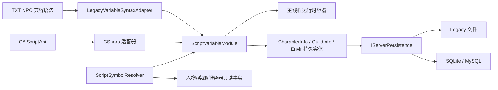

# 设计：翎风变量系统兼容实施规格

- 状态：草案
- 负责人：项目所有者
- 最后复核日期：2026-08-15
- 关联需求：2026-08-15 用户提出将翎风引擎变量系统移植到 LyoCrystal，并补充命名小数变量、声明热重载和 CHM 用户说明书要求
- 事实源：LyoCrystal 当前代码；`D:\ChuanQi\工具端\引擎\PC端\LFM2_chm_extracted` 中的翎风说明书
- 实施状态：VAR-01～08 已完成开发版实现、自动验证、进程冒烟和指定真实项目验收
- 取代关系：无

## 1. 结论与目标

当前 LyoCrystal 有临时 NPC 槽位、角色布尔标志、任务状态和公共 JSON 数值表，但没有一套统一覆盖“作用域、类型、生命周期、持久化、运算、文本替换、跨对象访问和调试”的变量系统。

本规格决定以翎风说明书的可观察行为为参考，在 LyoCrystal 现有脚本与持久化接缝内独立实现一套变量模块。目标不是复制翎风内部代码，也不是重建第二套脚本引擎，而是让脚本作者获得可预测、可持久化、可测试的变量能力，并为后续按需兼容翎风脚本语法提供稳定内核。

目标结果：

1. 脚本可以明确选择对话、角色在线、地图停留、服务器运行、角色持久、行会持久、服务器持久和周期重置作用域。
2. 整数、十进制小数、字符串、列表和字典具有统一的读取、修改、比较、清空和失败语义。
3. SQLite、MySQL 与 Legacy 文件模式在重启、掉线、换图和备份恢复后的行为一致。
4. 旧 TXT NPC 语法和 C# 热更脚本调用同一个变量模块，不各自维护状态。
5. 原始 NPC `A*` 临时槽位按项目决定由统一 A 全局持久字符串直接取代；其余兼容歧义仍必须显式审计。
6. 私人和全局命名小数变量继承对应作用域生命周期，日常操作与整数使用同一套命令。
7. 变量功能只有在开发说明、测试证据和 CHM 用户说明书同步完成后才能宣称完成。

## 2. 范围与非范围

### 2.1 本规格范围

- 翎风固定前缀变量：`P/D/M/N/S/I/G/A/U/T/J/Z`。
- 任意命名的 `N$`、`S$` 变量。
- 自定义 `HUMAN/GUILD/GLOBAL` 变量。
- `Decimal` 命名小数变量，可声明在 `P/D/M/N/I/G/U/J/HUMAN/GUILD/GLOBAL` 数值作用域。
- 逻辑标志 `[n]` 与现有角色 `Flags[]` 的关系。
- 列表 `L$`、字典 `D$` 及其基础操作。
- `MOV/INC/DEC/MUL/DIV`、比较、公式、随机、清空和格式化。
- `$STR(...)`、当前目标 `C.`、跨角色传递和脚本参数返回。
- 变量的 Legacy、SQLite、MySQL 保存、加载、迁移和回滚。
- 变量配额、路径安全、日志脱敏、主线程写入和失败关闭。
- 分阶段实施顺序、退出条件与当前进度。
- 声明注册表的启动加载、原子热重载、兼容失败和数据迁移规则。
- 每一阶段必须同步交付的 CHM 用户说明书页面。

### 2.2 非范围

- 不复制翎风、HeroM2 或其他商业引擎源码、二进制、协议和资源。
- 不重写 Roslyn 脚本热更、TXT NPC 解析器、协议序列化或整个持久化系统。
- 不在本任务中实现跨服变量同步；`U500-U599`、`T500-T599` 先保留。
- 不为了变量系统新增客户端权威状态；变量读写仍由服务端决定。
- 不承诺一次性实现说明书中数百个只读系统占位符。
- 不兼容会泄露密码、密保答案、电话、邮箱等敏感资料的说明书变量。
- 不默认允许脚本读写任意绝对路径或运行目录外文件。
- 不把 `SetTempDBMode` 的整角色存档回滚能力混入变量模块；它属于独立事务/副本玩法能力。

## 3. 来源盘点与可信度

### 3.1 扫描范围

说明书根目录共有 848 个 `.htm/.html` 页面，页面声明同时存在 GB2312 和 UTF-8。本次检索按页面声明显式使用 CP936 或 UTF-8 解码，没有使用 PowerShell 默认文本编码回写任何来源文件。

目录索引中有 22 个标题直接包含“变量”的主题；此外，数学表达式、配置读写、临时数据、字典、百分比计算和脚本初始化等页面也定义了变量生命周期或操作语义。

### 3.2 核心来源

| 来源页面 | 本规格采用的事实 |
|---|---|
| `其他相关资料/程序变量说明[!].htm` | 固定前缀、类型、作用域、生命周期、容量和扩展命名 |
| `功能操作命令/自定义变量功能.htm` | `HUMAN/GUILD/GLOBAL` 声明、读写、计算、比较和保存 |
| `其他相关资料/传奇基础脚本命令详解[!].htm` | `MOV/INC/DEC/MUL/DIV`、比较、随机和逻辑标志 |
| `其他相关资料/脚本变量大全[!].htm` | 只读人物、英雄、服务器和上下文占位符 |
| `功能操作命令/变量传递说明.html` | 在线角色间 `SetHumVar/GetHumVar` 行为 |
| `部分脚本实例/当前目标变量取值操作 .htm` | `C.` 当前目标只读访问和显式目标修改 |
| `游戏功能详解/扩展字符变量S和数字变量N[!].htm` | `S$名称`、`N$名称` 扩展变量 |
| `功能操作命令/元素变量.html` | `L$` 列表值、索引、追加、替换、删除、切片和排序 |
| `功能操作命令/键值对字典.htm` | `D$` 字典值、键值访问、增删、检查和极值 |
| `功能操作命令/数学表达式运算命令.htm` | 公式计算、随机表达式和除零失败 |
| `功能操作命令/清空变量.html`、`清空角色P变量.html` | 范围清空和对话变量强制清空 |
| `功能操作命令/读写配置项.html` | INI/缓存文件被当作附加变量保存方式的行为 |
| `兼容HeroM2/功能操作命令/排序人物自定义变量[!].htm` | 离线人物变量排序和导出 |
| `兼容HeroM2/功能操作命令/排序在线人物自定义变量[!].htm` | 在线 `HUMAN/GUILD/GLOBAL` 排序 |

### 3.3 来源冲突与待确认项

说明书不是形式化规格，存在版本叠加和文本冲突。实现前必须通过最小翎风样例服或用户提供的真实脚本确认以下行为：

1. 页面写作 `Z0-J499`，结合上下文应为 `Z0-Z499`，本规格暂按 `Z0-Z499` 建模，但保留契约测试。
2. `U` 变量正文写“正负 21 亿”，后续提示又将 `U` 列为 64 位变量；内部统一使用 `Int64`，兼容层是否限制范围由契约测试决定。
3. `T` 长度 256 按页面说明是 CP936 字节口径，即英文 1、汉字 2；不能用 .NET `string.Length` 直接等价。
4. `P` 的关闭行为与自定义按钮例外并不完全一致，因此需要显式“对话会话结束”事件，不依赖某一个 UI 包。
5. `J/Z` 每日重置的精确时区、补偿行为和停服跨日行为未形式化；本项目采用可重复计算的周期标识，不复刻“必须避开 00:00 停服”的脆弱行为。
6. 列表 `L$` 和字典 `D$` 页面没有明确说明是否持久化；第一版按角色在线临时变量处理，持久化必须另立兼容证据。

## 4. 翎风变量语义清单

### 4.1 固定前缀变量

| 前缀 | 类型 | 所有者 | 生命周期 | 翎风持久化 | LyoCrystal 目标语义 |
|---|---|---|---|---|---|
| `P0-P999` | 数字 | 当前角色 + 当前 NPC 对话 | 切换 NPC、关闭或结束对话即清零 | 否 | 对话会话变量 |
| `D0-D999` | 数字 | 当前角色 | 保持在线时跨 NPC，共享到掉线 | 否 | 角色连接变量 |
| `M0-M999` | 数字 | 当前角色 | 换图即清零 | 否 | 角色地图停留变量 |
| `N0-N999` | 数字 | 当前角色 | 小退/掉线清零 | 否 | 角色在线变量 |
| `S0-S999` | 字符串 | 当前角色 | 小退/掉线清零 | 否 | 角色在线变量 |
| `I0-I999` | 数字 | 当前服务器进程 | 重启清零 | 否 | 服务器运行变量 |
| `G0-G999` | 数字 | 当前服务器 | 跨角色、NPC 和重启 | 是 | 服务器持久变量 |
| `A0-A999` | 字符串 | 当前服务器 | 跨角色、NPC 和重启 | 是 | 服务器持久变量 |
| `U0-U499` | 数字 | 当前角色 | 掉线和重启后保留 | 是 | 角色持久变量 |
| `T0-T499` | 字符串 | 当前角色 | 掉线和重启后保留 | 是 | 角色持久变量 |
| `J0-J499` | 数字 | 当前角色 | 持久化，到配置的每日边界清零 | 是 | 角色周期变量 |
| `Z0-Z499` | 字符串 | 当前角色 | 持久化，与 `J` 同一边界清零 | 是 | 角色周期变量 |

补充规则：

- `N998/N999` 在翎风中被鼠标地图坐标占用；兼容模式必须保留，原生接口不使用魔法编号。
- `U500-U599/T500-T599` 与翎风跨服回传有关；本项目没有对应跨服事实源，先保留并拒绝脚本写入，不能悄悄当普通槽位。
- `N$任意名称` 是角色在线数字变量，`S$任意名称` 是角色在线字符串变量。
- 数字内部使用 `Int64`。兼容层按前缀执行范围检查，溢出时操作失败且不修改旧值。
- 缺失数字读取为 `0`，缺失字符串读取为 `""`；原生接口同时返回 `Found`，避免调用者无法区分缺失与显式零值。

### 4.2 命名小数变量

翎风固定编号数值变量保持 `Int64`，不得因为赋值包含小数点而动态改变类型。LyoCrystal 原生扩展提供显式声明的 `Decimal` 命名变量；它与整数共享变量模块、作用域和命令，只在声明及数值规则上不同。

```text
VAR Decimal P DropRate DEFAULT 0
VAR Decimal U PersonalRate DEFAULT 1.0
VAR Decimal G GlobalRate DEFAULT 1.0
VAR Decimal GUILD GuildRate DEFAULT 0
```

引用使用“作用域.名称”，同一脚本上下文允许使用无歧义短名：

```text
MOV P.DropRate 12.5
INC U.PersonalRate 0.25
MUL G.GlobalRate 1.2
CHECK GUILD.GuildRate >= 5.5
```

作用域与生命周期：

| 小数声明作用域 | 对应整数语义 | 所有者与生命周期 |
|---|---|---|
| `P` | `P0-P999` | 当前角色的当前 NPC 对话，结束即清除 |
| `D` | `D0-D999` | 当前角色连接，断线即清除 |
| `M` | `M0-M999` | 当前角色地图停留，换图即清除 |
| `N` | `N0-N999` | 当前角色在线会话，小退即清除 |
| `I` | `I0-I999` | 当前服务器进程，重启即清除 |
| `G` | `G0-G999` | 服务器持久 |
| `U` | `U0-U499` | 角色私人持久 |
| `J` | `J0-J499` | 角色私人持久，按每日周期清零 |
| `HUMAN` | 人物自定义变量 | 角色私人持久，可参与按名称查询 |
| `GUILD` | 行会自定义变量 | 行会持久 |
| `GLOBAL` | 全局自定义变量 | 服务器持久 |

数值规范：

- 使用 .NET `decimal` 的十进制语义，不使用 `float/double` 保存、比较或判定概率。
- 文本解析和持久化一律使用文化无关的小数点 `.`；禁止依赖服务器区域设置。
- `Integer` 与 `Decimal` 混合表达式提升为 `Decimal`；写回整数必须显式 `ROUND/FLOOR/CEIL/TRUNC`，禁止静默截断。
- 默认 `$STR` 使用规范化形式并去除无意义尾零；`$FORMAT(reference, digits)` 固定显示 0～8 位小数。
- 变量值是普通十进制数。几率页面必须明确单位；推荐用百分数点表示，例如 `12.5` 表示 `12.5%`。
- 概率判定把十进制值转换为整数阈值后使用服务器随机源，不以二进制浮点比较决定命中。
- 除零、范围溢出、超过允许小数位、非法格式或结果不可表示时失败，旧值保持不变。

声明与值实例严格分离：声明只是注册名称、类型、作用域、默认值和重置策略，不需要具体人物在线。私人变量也可以在服务器启动加载声明；具体人物的值在角色加载或首次访问时按需读取/创建，不批量填充数据库。

### 4.3 逻辑标志

翎风 `[n]` 通过 `SET/CHECK/RESET` 表示角色逻辑状态。LyoCrystal 已有持久化 `CharacterInfo.Flags[]`，第一版直接保留现有事实源，不把标志复制进通用变量表。

变量模块只提供标志适配，不改变现有任务和 NPC 可见性刷新行为。若未来需要超出 `Globals.FlagIndexCount` 的任意命名布尔值，应使用通用角色持久变量，而不是无限扩张固定数组。

### 4.4 自定义变量

翎风允许先声明类型，再按作用域操作任意名称变量：

| 翎风作用域 | 目标所有者 | 目标持久化 |
|---|---|---|
| `HUMAN` | 角色 | 是 |
| `GUILD` | 行会 | 是 |
| `GLOBAL` | 服务器 | 是 |

兼容声明与操作入口包括 `VAR Integer HUMAN/GUILD/GLOBAL 名称`、`LOADVAR`、`SAVEVAR`、`CALCVAR` 和 `CHECKVAR`，并包含显示、清理及在线/离线排序。LyoCrystal 不要求脚本作者为正常数据库保存显式执行 `LOADVAR/SAVEVAR`：变量写入后进入现有自动保存生命周期。兼容命令可以保留，但正常模式下分别映射为“确保已加载”和“请求保存”；只有显式导入/导出模式才接触文件。

自定义变量名称不能与固定前缀产生歧义。规范化后使用 `OrdinalIgnoreCase` 比较，保留第一次写入的显示名称；允许中文、字母、数字、下划线和点，禁止路径分隔符、控制字符、空白首尾和保留命名空间。

### 4.5 复合变量

`L$` 列表支持：

- 初始化、整体显示和清空；
- 从 0 开始的正索引和从尾部开始的负索引；
- 按索引读取、修改、插入和删除；
- 追加、按值删除、检查包含；
- 数量、极值、翻转、数字/文本排序和切片。

`D$` 字典支持：

- 字符串键值初始化；
- 按键读写、追加/替换和删除；
- 键数量、键/值列表、包含检查；
- 全数字检查及最大/最小值项。

第一版实现有界集合：单个列表最多 256 项，单个字典最多 256 项，单项字符串最多 1024 个 UTF-8 字节，单个角色所有临时复合变量总序列化大小默认不超过 256 KiB。达到上限时失败，不截断、不部分写入。

### 4.6 运算和比较

变量模块统一支持：

- 赋值：`Set`/`MOV`；
- 整数：加、减、乘、整除、取模；
- 小数：加、减、乘、十进制除法；
- 字符串：追加、删除匹配内容、按兼容字节区间删除；
- 比较：`= != > >= < <=`，整数与小数按提升规则比较；
- 随机：明确上下界和是否包含端点；
- 公式：兼容 `FORMULATION` 入口，支持括号、四则运算和受控 `Random(min,max)`；
- 清空：单项、连续槽位、作用域和对话全部清空。
- 转换：`ROUND/FLOOR/CEIL/TRUNC` 显式生成整数，`PARSEDECIMAL` 显式解析字符串。

除零、非法数字、越界、类型不匹配和公式解析失败均返回结构化错误，不写入目标变量。公式不得调用任意 .NET 方法、反射、文件、网络或进程能力。

### 4.7 变量解析和跨对象访问

- `$STR(reference)`：读取可变变量并格式化为文本。
- 只读系统占位符：从角色、英雄、服务器或当前事件上下文读取，不进入变量存储。
- `C.` 当前目标：只读访问目标角色；修改目标必须经过显式跨角色命令。
- `SetHumVar/GetHumVar`：第一版仅允许在线目标，通过主线程角色索引解析；离线写入必须另立事务接口。
- `GOTO/RETURN` 参数：使用独立调用帧保存，不借用角色全局临时槽位，避免嵌套调用互相覆盖。
- 输入变量：字符串和数字输入先经过长度、格式及禁止字符验证，再写入目标变量。

## 5. LyoCrystal 当前基线与差距

| 能力 | 当前实现 | 当前状态 | 与目标差距 |
|---|---|---|---|
| NPC 临时变量 | [`MapObject.NPCVar`](../../../src/Server/Server/MirObjects/MapObject.cs) | 部分存在 | 挂在对象上，仅支持一字母一数字键；没有对话、换图等精确生命周期 |
| TXT 变量解析 | [`NPCSegment`](../../../src/Server/Server/MirObjects/NPC/NPCSegment.cs) + 统一变量模块 | 已接入 | A0 与 A.名称均由统一 A 全局持久字符串接管；旧 `NPCVar` 不再处理 A 写入 |
| C# 脚本变量 | [`ScriptApi.SetVar/GetVar/CalcVar`](../../../src/Server/Server/Scripting/ScriptApi.cs) | 部分存在 | 仍直接操作 `NPCVar`，数字计算主要使用 `Int32` |
| 公共持久键值 | [`JsonValueStore`](../../../src/Server/Server/Scripting/JsonValueStore.cs) | 已存在 | 是文件/节/键表，不自动区分角色、行会和服务器作用域 |
| 角色逻辑标志 | [`CharacterInfo.Flags`](../../../src/Server/Server/MirDatabase/CharacterInfo.cs) | 已存在 | 仅布尔固定槽位，不是通用变量 |
| SQL 标志保存 | [`SchemaMigrator`](../../../src/Server/Server/Persistence/Sql/SchemaMigrator.cs) 与 `SqlServerPersistence` | 已存在 | 可作为变量持久化实现范例，但没有通用变量表 |
| 多后端持久化 | [`IServerPersistence`](../../../src/Server/Server/Persistence/IServerPersistence.cs) | 已存在 | 新状态必须同时覆盖 Legacy、SQLite、MySQL |
| 脚本热更 | [`Scripting`](../../../src/Server/Server/Scripting) | 已存在 | 变量模块应被现有脚本调用，禁止重建运行时 |
| 自动保存 | `Envir.RequestAutoSave` 与现有保存域 | 已存在 | 持久变量修改需接入脏标记和稳定快照 |
| 变量专项测试 | `Tests/Base05.Tests` | 缺失 | 当前没有覆盖作用域、重启和迁移的变量契约测试 |
| 真实内容脚本清单 | 仓库中未提交运行服 NPC 内容 | 缺失 | 无法证明现有 `%A0` 等前缀实际用法，切换前必须扫描部署项目 |

关键冲突：当前代码注释把 `%A1` 当作普通临时变量，而翎风 `A1` 是服务器持久字符串。禁止在未扫描真实内容脚本时原地改变含义。

## 6. 模块与接口设计

### 6.1 模块位置

新增深模块位于：

```text
src/Server/Server/Scripting/Variables/
```

模块职责：

- 解析规范化变量引用；
- 决定作用域、所有者、类型和生命周期；
- 执行原子读取、修改、比较和清空；
- 管理运行时容器和持久实体字段；
- 执行配额、范围、每日重置和错误语义；
- 给 TXT 兼容层、C# 脚本和测试提供同一个接口。

模块非职责：

- 不编译脚本；
- 不直接解析完整 NPC 文本；
- 不直接发送客户端消息；
- 不自行启动后台保存线程；
- 不拥有数据库连接；
- 不解析或暴露全部系统占位符。

### 6.2 外部接口

外部接口保持三个操作，不按每种前缀增加方法：

```csharp
public interface IScriptVariableModule
{
    VariableReadResult Read(in ScriptVariableContext context, ScriptVariableReference reference);
    VariableMutationResult Mutate(in ScriptVariableContext context, ScriptVariableMutation mutation);
    VariableResetResult Reset(in ScriptVariableContext context, ScriptVariableSelector selector);
}
```

接口契约：

- `ScriptVariableContext` 提供当前角色、当前目标、NPC 对话标识、地图实例、调用帧、服务器时钟和调用来源。
- `ScriptVariableReference` 已经过语法适配器解析，包含命名空间、作用域、类型和键。
- `ScriptVariableMutation` 表示赋值、数值运算、字符串操作或集合操作。
- 返回值包含成功、旧值、新值、是否产生持久化脏状态和稳定错误码。
- 接口只能在服务端主线程写入；非主线程修改返回 `WrongThread`，调用方必须通过现有主线程调度重试。

只读系统占位符形成独立的 `ScriptSymbolResolver` 模块。它可以调用变量模块读取 `$STR(...)`，但变量模块不能反向依赖数百个业务占位符，防止变量存储被人物属性逻辑淹没。

### 6.3 调用路径



### 6.4 声明注册表与热重载

声明文件是全服变量 Schema，不是“只有服务器变量才能在启动时声明”。`P/D/M/N/U/J/HUMAN/GUILD` 等私人声明在没有在线人物时也能注册；具体值仍归各自所有者并按生命周期延迟创建。

热重载复用现有 `Scripting` 文件监视、编译和切换接缝，不新增第二套监视器：

1. 从同一候选脚本版本收集 `VariableDeclaration`；
2. 校验名称、类型、作用域、默认值、重置规则、重复项和全部脚本引用；
3. 为新 `G/GLOBAL` 声明预加载持久值，为其他持久声明验证存储可用性；
4. 构建不可变候选注册表；
5. 在主线程安全点将“脚本快照 + 声明快照”原子切换；
6. 已经开始的调用继续使用旧快照，新调用使用新快照；
7. 任一步失败都保留旧版本，并报告文件、行号和稳定错误码。

热重载允许新增声明、修改说明/显示元数据，以及修改只影响“尚无值所有者”的默认值。下列变更禁止直接热改：类型、作用域、持久性、重置策略和持久键规范化规则。重命名按“新增变量 + 显式迁移 + 停用旧变量”处理。

删除声明不自动删除内存或数据库数据；只有独立、可审查、可回滚的数据清理任务才能物理删除。相同声明重复出现是幂等的；同名声明的契约不一致时整次重载失败。

## 7. 数据模型与持久化

### 7.1 内存模型

| 作用域 | 内存所有者 | 清理事件 |
|---|---|---|
| 对话 | `NpcConversationState` | 对话关闭、切换 NPC、连接断开 |
| 角色连接 | `PlayerObject` 的变量状态 | 断开连接 |
| 地图停留 | `PlayerObject` + 当前 `MapInstanceKey` | 地图实例变化 |
| 角色在线 | `PlayerObject` 的变量状态 | 断开连接 |
| 服务器运行 | `Envir` 的变量状态 | 进程停止 |
| 调用帧 | `NpcPageCall`/C# 调用帧 | 返回、异常或取消 |

旧 `NPCVar` 在迁移期由适配器读取；完成真实内容迁移后再删除直接访问，不能长期维护双写。

### 7.2 持久实体

新增统一值记录，字段至少包含：

- `Namespace`：如 `legacy.u`、`legacy.t`、`legacy.j`、`legacy.z`、`legacy.g`、`legacy.a`、`custom.human`。
- `Key`：规范化名称。
- `Kind`：`Integer/Decimal/String`；复合持久类型暂不开放。
- `IntegerValue`、`DecimalText` 或 `TextValue`：按 `Kind` 严格三选一。
- `DecimalText` 使用文化无关规范形式保存，读回后必须能无损还原 .NET `decimal`；SQLite、MySQL 和 Legacy 不得各自使用不同舍入语义。
- `ResetPolicy`：`None/Daily`。
- `ResetPeriodId`：最后一次已经应用的周期标识。
- `UpdatedUtcMs`：保存与诊断时间。

角色记录挂在 `CharacterInfo`，行会记录挂在 `GuildInfo`，服务器记录挂在 `Envir` 的世界状态。所有集合对外只读，修改只能经过变量模块。

### 7.3 SQL Schema

通过新的版本化 `SchemaMigration` 增加：

```text
character_script_variables
guild_script_variables
server_script_variables
```

建议主键：

- 角色：`(character_id, variable_namespace, variable_key)`；
- 行会：`(guild_id, variable_namespace, variable_key)`；
- 服务器：`(variable_namespace, variable_key)`。

建议索引：

- 自定义人物数字变量排行榜：`(variable_namespace, variable_key, integer_value)`；
- 每日清理扫描：`(reset_policy, reset_period_id)`；
- 不为字符串全文检索建立索引。

首期不开放 Decimal 排行榜，避免 SQLite 文本存储和 MySQL `DECIMAL` 排序产生跨后端差异。确有需求时另加统一规范化的可索引投影和三后端契约测试，不能直接对 `DecimalText` 做字符串排序。

迁移必须同时通过 SQLite 和 MySQL 方言测试，并验证重复执行、空库、已有数据、备份恢复和失败回滚。

### 7.4 Legacy 保存

- 角色和行会持久变量进入各自二进制模型，并提升 `Envir.CustomVersion`。
- 加载旧版本时变量集合为空；保存新版本后旧程序不保证可读取，因此升级前必须备份。
- 服务器持久变量在 Legacy Provider 下使用受管理的单一 JSON 文件，采用版本/类型完整校验、临时文件、上一版备份和原子替换；不复用散落的任意 INI 路径。
- 归档角色必须携带角色持久变量，恢复后保持不变。
- Legacy、SQLite、MySQL 的同一数据集往返结果必须一致。

### 7.5 每日重置

`J/Z` 不依赖“服务器恰好在午夜运行”：

1. 根据服务器逻辑本地时间和 `ScriptVariableDailyResetHour`（0-23）计算 `ResetPeriodId`；运营期间必须保持服务器时区稳定。
2. 读取或修改每日变量前，若存储周期落后，先在主线程将该所有者的 `J/Z` 原子清零并更新周期。
3. 服务运行时由现有主循环做分批预清理，避免第一次登录集中抖动。
4. 停服跨过多个周期只执行一次清零。
5. 时钟回拨不重复恢复旧值；服务器时区或重置小时变更需要维护窗口、备份和显式运维确认。

## 8. 兼容模式与迁移

### 8.1 兼容模式边界

`A0-A999` 不再参与模式切换：从 VAR-04 起始终由统一 A 全局持久字符串接管。以下模式只用于 VAR-07 尚未落地的其他跨对象和内容迁移歧义：

| 模式 | 其他旧语义 | 翎风前缀语义 | 用途 |
|---|---|---|---|
| `LegacyCurrent` | 保持现状 | 仅原生显式引用可用 | 默认升级安全模式 |
| `Audit` | 保持现状并记录歧义 | 只报告将发生的映射 | 扫描和试运行 |
| `LingFengCompatible` | 由显式映射接管 | 启用 | 完成脚本迁移后的项目 |

模式是项目级配置，启动后不可热切换。正式服若检测到未确认的歧义引用，`LingFengCompatible` 启动失败关闭。

### 8.2 真实内容预检

启用翎风兼容模式前，必须扫描实际 `Envir/NPC/QuestDiary` 内容并输出：

- 每个固定前缀的引用次数和文件位置；
- `A0-A999` 的读、写和运算（用于发现升级后共享/持久化语义风险）；
- 超出目标范围的索引；
- 任意绝对路径变量存取；
- `N998/N999` 和保留跨服槽位；
- 无法静态判断的动态变量名；
- 编码和换行格式。

预检只读，不自动改脚本。迁移脚本必须作为独立任务，经备份、差异审查和真实 NPC 冒烟后应用。

### 8.3 现有数据处理

- `JsonValueStore` 继续服务现有 `Values/*.json`，不自动解释为 `G/A`。
- 若用户指定某个 JSON 表导入服务器变量，使用一次性、可审查映射并记录来源摘要。
- 现有 `Flags[]` 不复制；`SET/CHECK/RESET` 直接适配。
- 旧 `NPCVar` 中的 A 临时值不迁移；升级后脚本首次写入 A 时建立新的全局持久事实。
- 不自动读取翎风 `Mir.db` 或 `GlobalVal.ini`；只有来源、格式和备份明确后才另立数据导入任务。

### 8.4 回滚

- 代码回滚：A 已是明确的不兼容替换，不能通过模式切回旧临时语义；必须恢复升级前程序和数据备份。其余兼容映射可切回 `LegacyCurrent`。
- SQL 回滚：代码可停止读取新表，但已写变量表不自动删除；恢复旧库必须使用升级前备份。
- Legacy 回滚：新二进制版本不能承诺被旧服务端读取，必须恢复升级前 `MirDB/MirADB/Guild` 备份。
- 脚本回滚：保留迁移前脚本目录和摘要，不用批量反向替换猜测恢复。
- 一旦正式服写入持久变量，禁止将“回滚 DLL”描述成完整数据回滚。

## 9. 不变量、失败模式与安全

### 9.1 不变量

1. 玩家、NPC、Hero、行会和服务器变量只在服务端主线程修改。
2. 同一变量修改是原子的；失败不改变旧值。
3. 变量键经统一规范化，同一作用域不产生大小写重复项。
4. 类型一旦声明不能由普通赋值静默改变。
5. 持久修改进入现有保存生命周期，并能在保存快照中稳定重现。
6. 脚本热更不清空运行时变量，也不改变已声明持久变量类型。
7. 客户端文本输入永远不是可信类型和值来源。
8. 只读系统占位符不进入可变存储。

### 9.2 失败模式

| 失败 | 行为 |
|---|---|
| 未知前缀或作用域 | 返回 `UnknownReference`，兼容模式记录脚本位置 |
| 类型不匹配 | 返回 `TypeMismatch`，不转换、不写入 |
| 数字溢出 | 返回 `Overflow`，保留旧值 |
| 小数位超过上限 | 返回 `ScaleExceeded`，保留旧值，不静默截断 |
| 除零/公式非法 | 返回 `InvalidExpression`，保留旧值 |
| 声明热重载冲突 | 返回 `DeclarationConflict`，整批保留旧脚本与旧注册表 |
| 对话或目标上下文缺失 | 返回 `ContextUnavailable` |
| 离线目标写入 | 第一版返回 `TargetOffline` |
| 配额超限 | 返回 `QuotaExceeded` |
| 持久化加载失败 | 持久作用域失败关闭，不用默认零覆盖数据库事实 |
| 保存失败 | 保留内存脏状态并走现有重试/告警，不谎报成功落盘 |
| 每日周期配置非法 | 启动失败，不按本地机器猜测时区 |

### 9.3 安全要求

- 明确不实现说明书中的 `<$PASSWORD>`、密保问题/答案、电话、邮箱等敏感占位符。
- 账号 ID、机器码、IP 等标识默认不向普通脚本开放；确需使用时另立权限与脱敏规格。
- 变量值默认不写普通运行日志；调试跟踪只显示键、作用域、结果状态和截断后的非敏感值。
- 文件兼容命令只能访问配置的脚本数据根目录，拒绝绝对路径、`..`、链接逃逸和设备路径。
- 单变量、单所有者、单次操作和全服总量都有上限；加载异常大数据时启动失败并报告具体所有者。
- 公式、格式化和变量名解析必须有长度与复杂度上限，防止脚本造成主线程长时间阻塞。

## 10. 测试与质量门禁

### 10.1 模块契约测试

通过 `IScriptVariableModule` 同一接口验证：

- 每个作用域的可见性和清理事件；
- 数字、字符串、列表、字典的正常和失败操作；
- `Integer/Decimal` 混合提升、显式取整、规范化显示和文化无关解析；
- 大小写、中文键、保留前缀和缺失值；
- 溢出、除零、非法公式、越界和配额；
- 嵌套调用帧及异常退出清理；
- 当前目标和跨在线角色访问；
- 热更前后状态保持。
- 新增声明无重启可见、默认值不覆盖旧值、冲突声明整批回退和并发调用快照一致。

### 10.2 生命周期集成测试

至少覆盖：

1. 同 NPC 对话、切换 NPC、显式关闭对话；
2. 同图、跨图、同地图不同实例；
3. 小退重登、完整掉线重登；
4. 服务端重启；
5. 每日边界、停服跨日和时钟回拨；
6. 角色归档和恢复；
7. 行会解散、改名和成员变更；
8. 自动保存并发请求及保存失败重试。

### 10.3 持久化测试

- Legacy 二进制旧版加载、新版往返和备份恢复；
- SQLite 空库迁移、重复迁移、往返和恢复；
- MySQL 同一契约、方言兼容和事务失败；
- 三后端同一固定数据集的语义等价；
- Decimal 的最大/最小值、0～8 位小数、负数、尾零、重启往返和非法存储文本；
- 排行榜索引查询只返回目标命名空间和类型；
- 损坏值、未知类型和超限数据失败关闭。

### 10.4 脚本兼容测试

- 为每个固定前缀建立最小 TXT 样例；
- `MOV/INC/DEC/MUL/DIV` 与比较；
- 命名 Decimal 在 `P/D/M/N/I/G/U/J/HUMAN/GUILD/GLOBAL` 中的同命令运算；
- `$STR` 默认去尾零、`$FORMAT` 固定位数、概率整数阈值边界和显式取整；
- `$STR`、输入、GOTO 返回、当前目标和跨角色传递；
- `L$/D$` 操作及非法索引；
- `LegacyCurrent/Audit/LingFengCompatible` 三模式；
- 真实项目只读预检和选定 NPC 的端到端冒烟。

最低构建门禁：

- `Server.Library` Release 构建；
- `Tests/Base05.Tests` 变量专项；
- SQLite 与 MySQL Schema 兼容测试；
- Legacy 持久化往返；
- 真实服务端启动、NPC 对话、掉线重登和重启恢复证据。

## 11. 分阶段开发进度

状态词只使用“已完成、部分存在、未开工、阻塞”，不以主观百分比冒充进度。

| 阶段 | 交付工件 | 退出条件 | 当前状态 |
|---|---|---|---|
| `VAR-00` 来源与基线 | 本规格、来源清单、代码差距 | 说明书语义、冲突和项目接缝可复核 | 已完成 |
| `VAR-01` 核心、声明热更 + P 纵向样板 | 窄接口、Integer/Decimal/String 值、声明注册表、P 生命周期、TXT/C# 双适配 | 无重启新增声明；整数和小数在同一真实 NPC 内可操作；关闭/切换后清零 | 已完成 |
| `VAR-02` 运行时作用域 | D/M/N/S/I、N$/S$、调用帧 | 换图、掉线、重启边界全部有自动化和真实运行证据 | 已完成 |
| `VAR-03` 角色持久变量 | U/T、Legacy/SQLite/MySQL、自动保存 | 掉线、重启、归档恢复及三后端往返一致 | 已完成 |
| `VAR-04` 服务器持久变量 | G/A、Legacy 原子 JSON、SQL 表 | 多角色共享、重启恢复、备份恢复一致 | 已完成 |
| `VAR-05` 周期与自定义作用域 | J/Z、HUMAN/GUILD/GLOBAL | 跨日、停服跨日、行会生命周期、排行查询通过 | 已完成 |
| `VAR-06` 复合值与表达式 | L$/D$、公式、概率、格式化 | 有界集合、十进制公式、概率边界、非法表达式和性能门禁通过 | 已完成 |
| `VAR-07` 跨对象与内容迁移 | C.、Set/GetHumVar、三模式预检、真实脚本迁移 | 无未解释歧义；选定真实版本脚本完成冒烟 | 已完成 |
| `VAR-08` 只读占位符扩展 | 按真实脚本缺口补齐的符号适配器 | 只实现被真实内容引用且通过隐私审查的符号 | 已完成 |

### 11.1 当前收口结论

`VAR-01`～`VAR-08` 已完成开发版实现与指定真实项目验收。后续脚本变更只按既有预检—审核—摘要确认流程增量维护；不因商业说明书存在更多条目而批量开放未被真实内容引用的占位符。

`VAR-01` 的完成定义：

- 一个 TXT NPC 和一个 C# 脚本通过同一模块读写 `P0` 与 `P.DropRate`；
- 同一对话内 `MOV/INC/DEC/MUL/DIV/比较/$STR/$FORMAT` 可观察；
- 新增 `VAR Decimal P DropRate` 后脚本和声明原子热重载，不重启服务器；
- 关闭、切换 NPC、断线均可靠清零；
- `A0` 和 `A.名称` 都通过统一变量模块工作；
- 模块契约测试、受影响构建、真实 NPC 冒烟和对应用户说明书页面均有输出工件。

`VAR-01` 收口证据（2026-08-15）：变量专项 25 项通过；真实 `Envir` 生命周期验证兼容声明热重载与冲突保旧；正式 `Server.dll --headless-variable-smoke` 以独立进程通过真实 `NPCSegment`、`PlayerObject`、C# 声明编译和统一变量模块，退出码为 0，并输出整数 3、小数 12.75、重置 1.5、新声明 0.5 与冲突拒绝标记；PC、移动端和协议专项构建/测试通过；网页说明书严格构建与搜索索引验收通过。

`VAR-02` 收口证据（2026-08-15）：变量专项增至 30 项，覆盖 D/M/N/S/I 所有者隔离、地图实例变化、N$/S$ 免声明扩展、Call 调用帧和缺失上下文；正式 `Server.dll --headless-variable-smoke` 退出码为 0，输出 `RUNTIME_SCOPES=True` 与 `SERVER_RESTART_CLEAR=True`，真实 TXT NPC 验证 D/N/S/I，统一模块验证 M，`PlayerObject.StopGame` 验证小退清理，同一宿主停启验证 I 清理；`Server.MirForms` Release 构建 0 错误。

`VAR-03` 收口证据（2026-08-15）：U/T 直接挂接 `CharacterInfo`，旧二进制自定义版本升级为 1，SQLite/MySQL 通过第 18 号迁移使用 `character_script_variables` 关系表；成功写入请求既有账户自动保存。变量及持久化定向测试共 39 项通过，覆盖 U/T 编号与命名小数、中文字符串、固定编号 0-499 边界、作用域类型约束、旧版 0 号自定义档案兼容、二进制往返、SQLite 新实例恢复、SQLite 角色归档恢复，以及 SQLite/MySQL 方言 Upsert。正式 `Server.dll --headless-variable-smoke` 退出码为 0，并输出 `PRIVATE_PERSISTENCE=True`。

`VAR-04` 收口证据（2026-08-15）：G/A 由 `Envir` 持有单一服务器共享存储，原始 NPC A 临时分流已移除；Legacy 使用 `Server.Variables.json` 临时文件刷新、上一版 `.bak` 与原子替换，SQLite/MySQL 通过第 19 号迁移使用 `server_script_variables`。55 项变量、生命周期及持久化定向测试通过，覆盖多实例共享、独立自动保存请求、类型约束、JSON 结构/语义损坏回退、SQLite 往返与清空、MySQL 方言及正常关服最终保存。正式进程冒烟输出 `SERVER_PERSISTENCE=True` 后作为最终运行门禁。

`VAR-05` 收口证据（2026-08-15）：J/Z 在角色持久容器中保存单调周期号，配置 `ScriptVariableDailyResetHour` 控制服务器本地日界线，在线批量预清理与首次访问延迟清理共存，时钟回拨不恢复旧值；HUMAN、GUILD、GLOBAL 分别绑定角色、行会和服务器。Legacy CustomVersion 提升为 2 并兼容 0/1，SQLite/MySQL 第 20 号迁移增加 `guild_script_variables` 与三类 Integer 排行索引。67 项变量、生命周期和持久化组合回归通过；正式宿主进程输出 `DAILY_RESET=True` 与 `CUSTOM_PERSISTENT_SCOPES=True`。

`VAR-06` 收口证据（2026-08-15）：L$/D$ 复用统一变量模块并按在线角色隔离，小退清理；单集合 256 项、单项 1024 UTF-8 字节、角色合计 256 KiB 均为失败关闭的原子配额。`FORMULATION` 使用受限十进制解析器，限制 1024 字符、256 词元和 32 层括号，支持四则、0～28 整数幂及包含两端点的 `Random`；`CHANCE` 用明确单位和百万整数阈值判定。变量专项 52 项通过，包含 1000 次公式主线程 3 秒保守性能门禁；正式宿主进程输出 `COMPOSITES=True`、`FORMULA=True` 与 `PROBABILITY=True`。

`VAR-07` 收口证据（2026-08-15）：`SETCURRTARGET` 只接受在线、同图、20 格内目标，`C.STR/C.HUMAN/C.GUILD` 每次读取重新校验且保持只读；`SETHUMVAR/GETHUMVAR` 只处理在线角色并复用统一变量模块。指定 `Server-mono/Envir` 共预检 2348 个 TXT/INI/CS 文件，摘要 `7E1E13532F37151BBC15E4B7B43383A8C1D95E3B0DC25944A2F19864D74ABE3D`，0 个阻断错误。36 处 A 引用全部位于“定位符咒”的两份等价生成内容；旧 `LOADVALUE/SAVEVALUE/%A*` 已统一到新 A 全服持久存储，正式进程冒烟输出 `LEGACY_A_ADAPTER=True`、`CROSS_OBJECT=True` 与 `COMPATIBILITY_PREFLIGHT=True`。

`VAR-08` 收口证据（2026-08-15）：真实快照识别 47 种只读系统占位符，全部在现有 `NPCSegment` 解析器中已有对应分支，无需重造解析系统。预检记录符号及次数，未审核符号以 `VAR08-UNKNOWN-001` 失败关闭；密码、密保、电话和邮箱类符号以 `VAR08-SENSITIVE-001` 明确拒绝。真实项目 C# 脚本编译、世界语义预检和快照回归测试通过。

最终门禁证据（2026-08-15）：变量模块、兼容预检、真实快照及真实项目语义专项共 64 项通过；SQLite/MySQL Schema、Upsert、排行、角色/行会/服务器变量往返与归档恢复专项 10 项通过；`Base05.Tests` 全量 591 项通过。`Server.MirForms` Release 构建 0 错误；独立 `Server.dll --headless-variable-smoke` 退出码 0，并同时报告 `INITIALIZE=True`、`PARSE_DECIMAL=True`、`LEGACY_A_ADAPTER=True`、`CROSS_OBJECT=True`、`COMPATIBILITY_PREFLIGHT=True` 及全部前置阶段标记。Material for MkDocs 严格构建、中文搜索词门禁、81 文件离线站点、ZIP 与旁路 SHA-256 清单均通过。

### 11.2 强制开发顺序与任务明细

下表是实施顺序的唯一入口。后续 Issue 可以拆细，但不得绕过阻塞依赖，也不得把后阶段能力提前混入当前阶段。

| 序号 | 工作项 | 依赖 | 主要代码工件 | 自动验证 | 同批用户说明书 |
|---|---|---|---|---|---|
| 01 | 值模型与稳定错误码 | 无 | `VariableValue`、`VariableKind`、结果类型 | Integer/Decimal/String 构造、比较、溢出 | 类型与错误处理 |
| 02 | 引用和声明解析 | 01 | 引用规范化、`VariableDeclaration` | 合法/非法名称、保留字、重复声明 | 声明语法与命名规则 |
| 03 | 声明注册表快照 | 02 | 不可变注册表、候选校验 | 幂等、冲突、默认值校验 | 声明与默认值 |
| 04 | 脚本原子热重载 | 03 | 接入现有 `Scripting` 切换点 | 成功切换、失败保旧、调用快照一致 | 热重载与排错 |
| 05 | P 运行时容器 | 01～04 | `NpcConversationState` 变量集合 | 对话保持、切换/关闭/断线清除 | P 对话变量 |
| 06 | 统一命令运算 | 05 | `Mutate` 的 MOV/INC/DEC/MUL/DIV/CHECK | 整数、小数、混合提升、除零 | 变量操作命令 |
| 07 | 显示与显式转换 | 06 | `$STR/$FORMAT/ROUND/FLOOR/CEIL/TRUNC` | 尾零、位数、区域设置、边界 | 显示格式与取整 |
| 08 | TXT 与 C# 双适配 | 05～07 | 两个薄适配器 | 同一场景同一结果 | TXT/C# 对照示例 |
| 09 | D/M/N/S/I 与 N$/S$ | VAR-01 | 连接、地图、在线、进程容器 | 每个清理事件和保留事件 | 临时变量分类 |
| 10 | U/T 角色持久 | 09 | 角色模型、脏标记、三 Provider | 掉线、重启、归档恢复 | 私人持久变量 |
| 11 | G/A 服务器持久 | 10 | 世界模型、Legacy 原子 JSON、SQL | 多人物共享、重启、恢复 | 全局持久变量 |
| 12 | J/Z 每日周期 | 10 | 周期标识、延迟清理、分批清理 | 停服跨日、回拨、配置变更 | 每日变量 |
| 13 | HUMAN/GUILD/GLOBAL | 10～12 | 命名持久作用域、索引 | 所有权、行会生命周期、整数排行 | 自定义变量 |
| 14 | L$/D$ | 09 | 有界列表与字典 | 配额、索引、排序和错误 | 列表与字典 |
| 15 | 公式、概率和格式化 | 06～07 | 受控表达式和概率阈值 | 复杂度、十进制、随机边界 | 公式与几率实例 |
| 16 | 跨对象访问 | 10～13 | C.、在线 Set/GetHumVar | 权限、离线、目标变化 | 当前目标和跨人物变量 |
| 17 | 兼容模式与真实内容预检 | 08～16 | 三模式、只读扫描结果 | 歧义脚本和真实 NPC 冒烟 | 兼容模式与迁移指南 |
| 18 | 按需系统占位符 | 17 | `ScriptSymbolResolver` 增量 | 真实引用、权限和隐私 | 占位符参考 |

### 11.3 每个工作项的统一完成门禁

每个工作项必须同时满足以下条件，缺少任何一项都保持“未完成”：

1. 规格中的可观察行为和非范围已确认；
2. 生产代码只通过变量模块接口改变状态；
3. 单元/契约测试覆盖正常、边界和失败路径；
4. 受影响项目 Release 构建通过；
5. 涉及生命周期时有真实服务端事件证据；
6. 涉及持久化时三 Provider 往返、备份和恢复通过；
7. 说明书站点新增或更新功能页、命令页、示例、错误和版本状态；
8. 说明书站点严格构建与中文搜索词检查通过；
9. 发布说明列出兼容、迁移、回滚和已知限制；
10. 代码、测试、说明书与发布物来自同一提交。

### 11.4 实施注意事项

- `VAR` 是加载期声明，不是登录时重复执行的状态修改；QM 中出现的声明也在脚本加载期收集。
- `INITVAR` 只在当前所有者尚无值时写默认值；普通 `MOV` 不得被当作登录初始化，否则会覆盖存量。
- 默认值变更只影响尚无值的所有者；禁止热更后批量覆盖在线或离线人物。
- 私人声明可以在服务器启动注册，因为声明没有人物所有权；人物值在加载或首次访问时实例化。
- 固定编号前缀继续是整数；命名小数继承同作用域，但不得让 `P0` 因 `MOV P0 1.5` 动态变型。
- `Decimal` 显示与概率单位必须在说明书示例中写明；不得混用“0.5 表示 50%”和“0.5 表示 0.5%”。
- 热重载是脚本与声明的原子版本切换；禁止脚本先切换、声明随后补注册。
- 数据格式、类型、作用域和重置策略变更必须显式迁移，不能伪装成普通热重载。
- 任何对翎风行为的兼容都必须由本规格和契约测试支持；不得复制商业说明书页面或素材进入发布物。

## 12. 发布与运维

- 数据 Schema 和 Legacy 格式变更必须单独备份后发布。
- A 作用域作为明确的不兼容变更直接启用；发布前搜索 A0-A999 并备份。其余 VAR-07 兼容能力首次发布仍默认 `LegacyCurrent`，先运行 `Audit` 收集歧义。
- 灰度观察变量错误计数、保存延迟、保存失败、单所有者变量数量和主线程操作耗时。
- 达到配额或解析错误不应导致服务崩溃，但持久化事实无法加载时必须失败关闭。
- 发布物不得包含翎风说明书、商业引擎文件或提取目录；仓库只保留独立撰写的行为规格和 LyoCrystal 实现。

### 12.1 说明书交付

引擎用户说明书以仓库 `Manual/Engine/` 的 Material for MkDocs 源文件为唯一事实源。变量功能页面按“概念—作用域—声明—命令—示例—错误—迁移”组织；开发规格不直接复制成用户说明书。

功能处于本规格的“未开工/阻塞”状态时，说明书页面必须显示“规划中，不可用于当前正式服”，不能给出仿佛已发布的操作承诺。某阶段通过全部代码与运行门禁后，才把对应页面状态改为“已实现”，并在发布清单中记录首次支持版本。

站点发布至少输出：静态 HTML 目录、搜索索引、来源版本、构建时间和压缩包摘要。CHM 只允许作为同一 Markdown 事实源的可选派生物，不单独手工维护第二套内容。

正式说明书构建使用 `Manual/Engine/requirements.lock.txt` 固定的完整依赖，并从 `Manual/Engine/` 运行 `Build-Manual.ps1`；`mkdocs build --strict` 的任何警告都阻断说明书交付。

## 13. 说明书变量主题索引

目录中标题直接包含“变量”的 22 个主题如下，用于后续实现审查逐项回查：

1. 变量支持数字单位；
2. 当前目标变量取值操作；
3. GOTO 参数返回值保存到变量；
4. 变量传递说明；
5. 多元数组元素变量；
6. 装备名检测结果保存到变量；
7. 清空 P 变量；
8. 清空变量；
9. 自定义变量按值排序；
10. 自定义变量功能；
11. 读取文本内容到变量；
12. 排序人物自定义变量；
13. 排序在线人物自定义变量；
14. `DEC` 对字符型变量操作；
15. 程序变量说明；
16. 登录器标识变量；
17. 脚本变量大全；
18. 数据库变量说明；
19. 怪物爆率支持变量；
20. 扩展字符变量 S 和数字变量 N；
21. 人物注册资料变量显示；
22. 改名后装备名字变量。

这些主题不等于全部首期范围。纯业务返回变量和敏感资料变量必须先经过真实需求、权限和隐私审查；核心变量系统以第 4 节的可变状态与生命周期为准。
