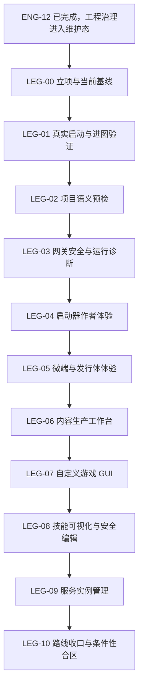
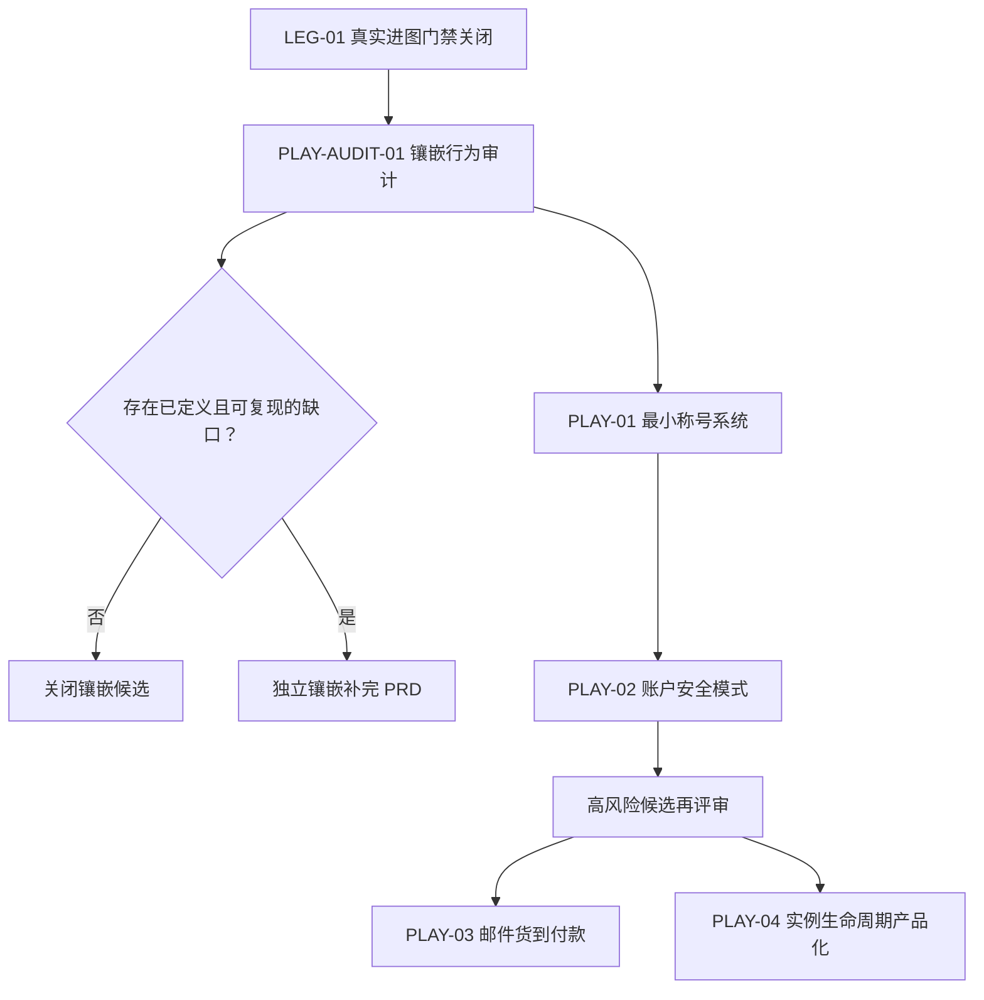

# 传奇类参考源码吸收开发路线

- 状态：已完成并转入维护
- 负责人：项目所有者
- 最后复核日期：2026-08-14
- 事实职责：维护传奇类参考源码的候选吸收范围、实施顺序和阶段门禁
- 当前任务状态：LEG-00～LEG-10 已通过各自独立规格完成并进入维护态；候选项仍不自动成为活动产品队列
- 上位约束：[`AGENTS.md`](../../AGENTS.md)、[`工程开发规范.md`](../governance/工程开发规范.md)、已接受 ADR
- 相关专项：[`自定义启动器-微端-游戏GUI推进开发路线.md`](自定义启动器-微端-游戏GUI推进开发路线.md)
- 取代关系：不取代现有 PRD、ADR、工程治理路线和启动器专项路线

## 1. 文档目的

本文对 `D:\ChuanQi\工具端\引擎\yuanma` 内全部传奇类参考源码进行最终归类，并与 LyoCrystal 当前代码相互对照，回答四个问题：

1. 哪些功能和方法值得吸收；
2. 哪些能力已经存在，不应重复建设；
3. 哪些只能参考产品行为，哪些可以重写复刻，哪些才可能局部移植；
4. 后续应从哪里开始、按什么依赖推进、到什么条件结束。

本文最初作为候选开发路线，现已由 LEG-00～LEG-10 的独立规格、代码、测试与 Evidence 完成收口。后续候选仍须重新建立活动 PRD、Issue 或实施规格，不能因本路线完成而自动开工。

## 2. 审查范围与覆盖口径

### 2.1 纳入的源码族

| 源码族 | 主要路径 | 审查重点 | 总体判断 |
|---|---|---|---|
| 91/JONE | `91/JONE/trunk/Source` | 项目 IDE、脚本与任务编辑、项目校验、掉落、地图、技能、自定义 UI、压力测试、微端 | 作者工具和验证思路最完整，优先借鉴工作流与领域模型 |
| BLUE_64 | `BLUE_64/ArkMir(XE10)/src` | 网关规则、资源工具、管理窗体、测试玩家、引擎配置 | 网关分层限流和运营可观察性有价值，旧网络实现不移植 |
| AppleM2 | `GameOfMir_AppleM2-main/SourceCode` | 地图、刷怪、NPC 可视化、资源编辑、插件边界 | 内容生产工具的交互闭环有价值 |
| 54MAX | `54MAX引擎D3D/Source` | 内置辅助、启动器、合区、数据库转换、插件 | 辅助思路已吸收；合区预演与冲突报告可作为远期候选 |
| 188BLUE | `188BLUEM2/Source` | GameCenter、微端、网关、服务编排、数据库管理 | 服务实例档案与依赖编排有价值；微端底层已被当前实现超过 |

热血江湖 `v23LS+GS源码` 已按产品决定排除，不进入本文路线。

### 2.2 覆盖方法

本轮先盘点各源码族的工程入口、业务目录和工具，再深读具有独立用户价值的代表模块。以下内容不重复计入能力：

- 第三方组件、控件包、编译器示例和演示工程；
- 同一源码的备份、复件、未使用目录和不同 Delphi 版本工程文件；
- 编译产物、压缩包、图片资源和历史中间文件；
- 仅改变外观、命名或旧协议格式而没有新增工作流的重复实现。

因此，“全面”指所有传奇源码族和主要能力域均已覆盖，不表示逐行审计数万份第三方与重复文件。

参考源码位于仓库外，现有 Markdown 链接检查不能验证这些相对路径。每次复核本文或参考源码根目录变化时，必须用一次性 `Test-Path`/`rg --files` 核对本章列出的关键入口；路径失效时标记为过期并修正文档，不为此新造常驻扫描工具或 CI 依赖。

## 3. 总结论

参考源码剩余的高价值，不在旧网络、旧渲染或旧数据库，而集中在以下八类能力：

1. 真实玩家链路自动验证；
2. 整个版本项目的语义预检；
3. 地图、NPC、刷怪、掉落和资源的可视化生产闭环；
4. 网关行为限流、处罚分级和运营诊断；
5. 服务实例档案、依赖启动和运行管理；
6. 启动器与游戏 GUI 的作者工作流；
7. 技能范围、条件、结果和表现的可视化建模；
8. 少量经现有代码反证后仍成立的玩法增量，如称号、安全模式、邮件货到付款和实例生命周期。

LyoCrystal 的底层基础普遍更现代：已有唯一协议源、脚本热更、微端、签名发布、FairyGUI 运行时、渲染接缝、SchemaMigrator、SQLite 备份、登录保护和基础运维指标。正确策略是扩展这些现有接缝，不把旧引擎移植成第二套运行系统。

## 4. 法律、来源与清洁室约束

参考源码整体没有发现清晰、统一、可证明覆盖业务源码的许可证。第三方组件即使单独存在许可证，也不代表整套商业引擎代码可复制。

所有吸收工作必须遵守：

1. 默认只参考功能、交互、状态机、不变量和边界场景；
2. 禁止复制 Delphi 实现代码、资源文件、私有协议常量、皮肤和图片；
3. 先用中文规格重新描述行为，再基于 LyoCrystal 接口独立实现；
4. 只有来源和许可证明确、依赖边界清楚的纯算法，才可单独进行复用评估；
5. 每个实现任务在审查中记录参考来源、实际复用内容和许可证结论；
6. 不把参考源码加入 LyoCrystal 的生产工程、构建路径或发布包。

## 5. 当前能力对照与吸收决定

### 5.1 吸收分级

本文所称“吸收”不等于复制源码，统一使用以下等级：

| 等级 | 含义 | 允许方式 | 典型对象 |
|---|---|---|---|
| R1 行为参考 | 只提取用户流程、状态、不变量和失败场景 | 先写中文规格和测试，再独立实现 | 自动玩家、活动流程、GameCenter 工作流 |
| R2 模型复刻 | 复刻领域概念和信息结构，接口按当前架构重新设计 | 使用当前类型、线程、持久化和协议接缝重写 | 项目预检、技能范围、服务实例档案 |
| R3 适配实现 | 在现有 LyoCrystal 模块中增加同等能力 | 修改既有模块并提供行为回归，不建立平行系统 | 地图编辑、掉落分析、启动器设计器 |
| R4 局部移植候选 | 仅限许可证明确、无外部耦合、可用测试证明的纯算法 | 单独许可证审查、隔离提交、来源声明和等价测试 | 个别概率或几何纯函数；当前未批准任何对象 |
| X 排除 | 技术、法律或架构风险高于收益 | 不进入设计和生产依赖 | 旧网络、协议、渲染、加密、机器码、DLL 插件 ABI |

当前路线默认使用 R1～R3；“同为同类引擎”或“能编译”不构成 R4 批准依据。

| 能力域 | 参考源码证据 | LyoCrystal 现状 | 决定 | 优先级 |
|---|---|---|---|---|
| 启动器、微端、版本管理 | 91 登录器设计；188 微端与 GameCenter；54MAX 配置器 | 已有 Launcher、MicroGateway、签名、历史、回滚 | 不重造；继续完成真实启动链路和作者体验 | P0 |
| 内置辅助 | 54MAX、91、BLUE 功能配置 | 候选实现位于未合并分支 `codex/pc-assistance-system`；该分支自己的验收文档仍列有未完成实机门禁 | 不再复制其他辅助实现；另立任务审查候选实现、协议兼容与实机证据，未合并前不得写成主线已具备 | 候选待收口 |
| 端到端自动玩家 | 91 压力测试、BLUE MakePlayer | 只有局部启动器/协议测试，缺少真实登录选人进图证据 | 基于 `Shared` 重写最小协议探针 | P0 |
| 项目语义预检 | 91 `M2ProjVerify`、`M2MapUseInfo` | 各模块有局部校验，没有统一跨域检查入口 | 新增只读预检核心，先 CLI/测试后接 UI | P0 |
| 地图、刷怪、NPC 可视化 | AppleM2 地图/NPC/刷怪工具；91 地图视图 | 已有 `VisualMapInfo`，但编辑闭环不足 | 渐进增强现有工具 | P1 |
| 掉落编辑与概率分析 | 91 掉落编辑、概率编辑；当前 DropBuilder | 已有掉落定义和编辑入口 | 增加引用检查、期望产出、模拟和差异 | P1 |
| 资源依赖与瘦身 | 91 地图使用信息；AppleM2 资源分析 | 已有 LibraryEditor、资源清单和微端包 | 建立只读引用图、缺失报告和未使用候选 | P1 |
| 网关规则与处罚 | BLUE RunGate/LoginGate/SelGate `PacketRuleConfig`、动作速度配置 | 已有登录保护，游戏动作与封包治理不统一 | 建立服务端权威的分层限流与观察指标 | P1 |
| 服务实例管理 | 188 GameCenter | 有服务端和独立微端宿主，缺统一实例档案 | 建立配置档案、预检、健康和日志编排 | P2 |
| 脚本 IDE | 91 项目编辑器、补全、搜索 | 已有 Roslyn 热更、调试器、AI 草稿 | 补 API 目录、引用跳转和项目诊断，不重写运行时 | P2 |
| 任务编辑 | 91 `uMissionEditorFrm` 的任务、奖励和属性编辑 | 已有 `QuestInfoForm`、`QuestDefinition` 和 `CSharpQuestProvider`，但缺少贯通元数据、目标、奖励、脚本与校验的作者闭环 | 纳入 LEG-06 候选子项；先组合只读视图，再受控编辑，不建立第二套任务事实源 | P2/待单独立项 |
| 旧内容受控导入 | 91 DB→JSON、AppleM2 BDE→XLSX、54MAX 数据转换工具 | 已有 JSON 存储和 `SchemaMigrator`，但没有面向这些旧内容的通用导入承诺 | 有真实数据迁移需求时按“只读解析→映射预览→校验→临时输出→显式导入”实施单向适配器 | P2/条件性 |
| 套装编辑 | 91 `M2SuitEditor` | 已有装备套装加成深模块，无统一作者编辑入口 | 作为 LEG-06 的低优先级候选，不另建套装运行系统 | P3/条件性 |
| 自定义游戏 GUI | 91 `M2UIDsgn`、运行控件 | FairyGUI 运行时已有，自定义 GUI 为零 | 按现有专项路线分静态/动态两阶段实现 | P2 |
| 技能编辑 | 91 SkillEditor、`M2CustomMagicEditorFrm`、`M2MagicStrengthenFrm` | 现有技能由 `MagicInfo`、代码和协议共同承载 | 基线只做现有技能的只读可视化与白名单字段；新建技能、强化规则须另立高风险 ADR/PRD | P3 |
| 一区多服拓扑 | 188 `一区多服.txt` 的端口偏移、共享登录服务与区服表 | 尚无统一实例档案；当前持久化有单写线程等现代边界 | LEG-09 只吸收实例、端口和依赖建模；共享账号/身份数据须另立架构决策 | P3/条件性 |
| 合区 | 54MAX、188 Consolidation | 当前 SQLite/MySQL 体系和备份更现代，无现代合区闭环 | 只有出现真实多区合并需求才启动 | P4/条件性 |
| 旧插件系统 | AppleM2、54MAX、BLUE 插件 | 已有 `src/Server/Server/Scripting` 旁路 Hook | 只参考生命周期，不迁移 DLL ABI | 不实施 |
| 旧网络、协议、渲染、加密 | 各源码族 | 当前已有明确事实源和接缝 | 禁止移植 | 排除 |

## 6. 关键参考证据

### 6.1 真实玩家链路

91 压力测试定义了从登录网关到游戏状态的明确状态机，包括登录、选服、查角色、创建或选择角色、开始游戏、游戏网关、心跳和断线：

- `91/JONE/trunk/Source/测试分析/压力测试工具/StructDefine.pas`
- `91/JONE/trunk/Source/测试分析/压力测试工具/ConnectThread.pas`
- `BLUE_64/ArkMir(XE10)/src/Tools/MakePlayer/Main.pas`

应吸收状态模型和场景，不复制旧封包、压缩、加密与线程实现。

### 6.2 项目语义预检

91 的项目验证器检查 NPC 商店、普通商店、怪物掉落、挖矿掉落、刷怪、物品和怪物引用，并能区分使用、未使用和缺失地图：

- `91/JONE/trunk/Source/M2ProjectBuilder/M2ProjVerify.pas`
- `91/JONE/trunk/Source/M2ProjectBuilder/M2MapUseInfo.pas`

其核心价值是把地图、NPC、怪物、物品、掉落、商店、脚本和资源看成一个引用图。

91 的 `开发文档/M2对象.xlsx`、`物品类型.txt`、`附加属性类型.txt` 和 `版本里程.xls` 可作为旧数据语义、类型映射和迁移风险的参考输入，但不能替代 LyoCrystal 当前代码、Schema 与测试这一事实源。

### 6.3 内容生产工具

AppleM2 地图编辑器具有加载、保存、格式转换、撤销、画刷和资源分析；另有 NPC 预览和刷怪配置工具：

- `GameOfMir_AppleM2-main/SourceCode/Tools/地图编辑器/EdMain.pas`
- `GameOfMir_AppleM2-main/SourceCode/Tools/地图编辑器/MapConvert.pas`
- `GameOfMir_AppleM2-main/SourceCode/Tools/NPC Visual Editor`
- `GameOfMir_AppleM2-main/SourceCode/Tools/刷怪配置生成器`

91 还提供掉落、商店、任务、地图描述、资源、SQL 和脚本编辑入口。应吸收跨内容导航和保存前校验，不复制巨型单体 IDE。

任务与受控导入的参考入口：

- `91/JONE/trunk/Source/M2ProjectBuilder/uMissionEditorFrm.pas`
- `91/JONE/trunk/Source/DBConvert2Json/TableConveterFrm.pas`
- `GameOfMir_AppleM2-main/SourceCode/Tools/数据库转换工具/BDEToXLSXConverter.pas`
- `54MAX引擎D3D/Source/数据库转换工具/FrmMain.pas`

这些转换器只提供字段识别、映射预览和错误处理思路。不得把旧 BDE/二进制数据库引擎接入生产；新导入器不得直接写生产数据库，必须生成当前 JSON/SQLite Schema 可验证的临时结果。

### 6.4 网关安全规则

BLUE 网关配置覆盖：

- 单 IP 最大连接数；
- 正常/最大封包尺寸与消息频率；
- 移动、攻击、施法、拾取、聊天等动作间隔；
- 临时限制、永久限制和处罚升级；
- IP 段、硬件标识和滥用文本过滤；
- 在线连接观察和人工处置。

参考入口：

- `BLUE_64/ArkMir(XE10)/src/Server/RunGate/Forms/PacketRuleConfig.pas`
- `BLUE_64/ArkMir(XE10)/src/Server/LoginGate/Forms/PacketRuleConfig.pas`
- `BLUE_64/ArkMir(XE10)/src/Server/SelGate/Forms/PacketRuleConfig.pas`
- `54MAX引擎D3D/Source/M2Server/ActionSpeedConfig.pas`

应吸收“按动作分类、先观察再处罚、限制有期限和证据”的方法。硬件封禁、旧过滤算法和网关内直接修改玩家状态不进入当前实现。

### 6.5 服务编排和合区

188 GameCenter 提供多服务路径、端口、启动顺序、延迟和实例配置。54MAX/188 合区工具提供账号、角色、行会和 ID 冲突处理思路：

- `188BLUEM2/Source/GameCenter/GMain.pas`
- `188BLUEM2/一区多服.txt`
- `54MAX引擎D3D/Source/合区工具/FrmMain.pas`
- `188BLUEM2/Tools/Consolidation`

`一区多服.txt` 证明旧方案通过端口偏移、共享 LoginSrv/LoginGate 和区服地址表组织多个区。当前项目只吸收声明式实例档案、端口冲突检查、健康检查和合区预演；共享账号/身份库属于数据一致性与故障域决策，必须另立 ADR，不复制明文账号编辑、直接杀进程或二进制数据库操作。

BLUE 的 `BLUE_64/ArkMir(XE10)/src/Server/M2Engine/Server/DBSQL.pas` 可用于理解旧内容表、SQLite 使用方式和迁移边界，但 LyoCrystal 已有自己的单写线程、`SchemaMigrator` 与在线备份体系，因此只作数据语义和故障场景参考，不作为持久化实现来源。

### 6.6 技能与自定义 GUI

91 SkillEditor 将技能拆为选择条件、作用范围、结果和视觉/声音效果：

- `91/JONE/trunk/Source/SkillEditor/RangeSelDlg.pas`
- `91/JONE/trunk/Source/SkillEditor/TargetActionsDlg.pas`
- `91/JONE/trunk/Source/SkillEditor/SkillEffectDlg.pas`
- `91/JONE/trunk/Source/M2ProjectBuilder/M2CustomMagicEditorFrm.pas`
- `91/JONE/trunk/Source/M2ProjectBuilder/M2MagicStrengthenFrm.pas`
- `91/JONE/trunk/Source/M2ProjectBuilder/M2SuitEditor.pas`

91 游戏 UI 工具提供控件树、属性、资源、预览和运行描述。具体吸收边界以[`自定义启动器-微端-游戏GUI推进开发路线.md`](自定义启动器-微端-游戏GUI推进开发路线.md)为准。

## 7. 实施总原则

1. **先关闭真实缺陷，再扩展作者工具**：启动器选区后不能进图未用真实端到端证据关闭前，不开始大型 GUI 或技能编辑。
2. **先只读诊断，再允许写入**：项目预检、资源分析、技能可视化先只读；验证稳定后再增加编辑和保存。
3. **先纵向样板，再横向平台**：每阶段选择一个真实场景贯通，不先造覆盖所有未来需求的通用平台。
4. **事实源不变**：协议仍归 `src/Shared/Shared/`，数据库演进仍归 `SchemaMigrator`，脚本仍归 `src/Server/Server/Scripting`，发布仍归现有 Launcher/MicroGateway。
5. **主线程权威**：玩家、NPC、Hero、宠物和活动权威状态只在服务端主线程修改。
6. **可恢复写入**：编辑器写配置或资源必须使用临时输出、校验、原子替换和备份；不直接破坏源文件。
7. **每阶段独立立项、分支、提交和门禁**：不得把整条路线作为一次大开发合并。
8. **不以界面数量衡量完成**：完成标准是一个真实工作流可用并可验证。

## 8. 从开始到结束的路线

路线严格按 `LEG-00` 至 `LEG-10` 推进。ENG-12 已完成并进入维护态，产品冻结前置已经解除；但任何 `LEG` 阶段仍须单独立项，不因本文存在而自动开工。

### 8.1 阶段总览与投入估算

以下为单一主线、已有基础不被推翻时的开发人周估算，用于拆任务和识别异常，不是发布日期承诺。真实排期须在阶段立项时依据最新代码和可用设备重新估算。

| 阶段 | 主要依赖 | 预计投入 | 用户可见工件 |
|---|---|---:|---|
| LEG-00 立项与基线 | 已满足：ENG-12 完成 | 0.5～1 人周 | 可执行任务、真实环境基线、验收与回滚入口 |
| LEG-01 真实链路 | LEG-00 | 1～3 人周 | 可重复的启动、登录、选人、进图证据与故障定位 |
| LEG-02 项目预检 | LEG-01 | 3～5 人周 | 跨域错误报告、样例项目和发布前阻断能力 |
| LEG-03 网关治理 | LEG-01、监控基础 | 3～6 人周 | 观察面板、限流规则、处罚证据和 Kill Switch |
| LEG-04 启动器体验 | LEG-01、现有 Launcher | 5～9 人周 | 成熟画布设计器和真实玩家入口 |
| LEG-05 微端发行体体验 | LEG-02、LEG-04 | 3～5 人周 | 发行体概览、入口预检和双端资源证据 |
| LEG-06 内容生产工作台 | LEG-02 | 8～14 人周 | 地图/NPC/刷怪/掉落/资源纵向编辑闭环 |
| LEG-07 自定义游戏 GUI | LEG-04、LEG-05 | 12～20 人周 | PC/Android 静态窗口及一个动态业务闭环 |
| LEG-08 技能工具 | LEG-02、LEG-06、LEG-07 | 7～12 人周 | 技能只读预览和受控字段编辑闭环 |
| LEG-09 服务实例管理 | LEG-03、LEG-05 | 4～7 人周 | 测试环境档案化启动、健康、日志和停止 |
| LEG-10 收口 | 已激活阶段完成 | 2～4 人周 | 统一入口、版本差异、文档和候选关闭结论 |

若全部阶段依次激活，工程量约为 48～86 人周。应以阶段门禁逐项决定是否继续，不应一次性承诺整条路线；LEG-07 和 LEG-08 是主要成本与风险中心，合区不包含在估算内。

### LEG-00：立项与可复现基线

**目标**：将候选路线转换成一个可执行的小阶段，而不是一次领取全部路线。

**前置条件**：权威治理路线已确认 ENG-12 完成；每次激活 LEG-00 时仍须重新证明最新 `main` 必需检查通过，并把工作树整理为干净或已明确归属、不会污染本任务的状态。

**工件**：

- 首个活动 PRD/Issue，建议范围只含 `LEG-01`；
- 当前真实客户端、服务端、资源版本和测试账号的受控基线；
- 参考来源记录和清洁室实现声明；
- 快内环、慢外环、回滚和证据目录。

**退出条件**：范围、非范围、真实环境、验收账号、失败判据、回滚路径均明确。

### LEG-01：真实启动、登录、选人和进图验证

**目标**：先关闭当前最直接的启动阻断，并建立后续变更共同使用的真实链路探针。

**实施内容**：

1. 用真实生成的玩家入口完成“启动器选区→启动 Client→登录→选人→进图→移动一次→退出”；
2. 基于当前 `Shared` 协议和客户端行为建立最小状态机探针；
3. 区分已有客户端复用、首次安装核心、缓存命中和微端回退；
4. 输出每阶段时间、服务器响应、失败原因和进程退出状态；
5. 修复必须先有能失败的回归或集成证据。

**禁止**：复制 91/BLUE 协议客户端；把 UI 冒烟当作进图证据；为测试改写协议。

**退出条件**：自动探针与一次真实客户端流程均通过；失败时能定位在启动器、进程、登录、选人、进图或资源阶段。

### LEG-02：项目语义预检

**目标**：发布前发现跨地图、怪物、物品、NPC、脚本、掉落、商店、配方和资源的悬空引用。

**首批规则**：

- 地图记录存在且地图文件可读取；
- 刷怪引用的怪物存在，数量、范围和刷新时间有效；
- NPC 坐标合法，脚本和商店引用存在；
- 掉落物品、概率和分组有效；
- 配方成品、材料、工具和数量有效；
- 启动核心与资源清单引用存在且摘要一致；
- 错误、警告和建议具有稳定代码与源位置。

**实现边界**：先建立无 UI 的只读领域服务和测试，真实消费者确定后接入 `src/Server/Server.MirForms` 或 `src/Launcher/Launcher.Editor`；不得创建第二套配置事实源。

**退出条件**：使用一套故意破坏的样例项目证明每类规则能发现问题；使用正常项目证明无误报阻断；报告可定位到具体文件、记录或实体。

### LEG-03：网关安全与运行诊断

**目标**：把 BLUE 的网关规则思想转化为当前服务器的可观察、可测试、可回退的行为治理。

**实施内容**：

- 对登录、移动、攻击、施法、拾取、聊天和超大封包分别统计；
- 先建立观察模式和基线，再启用软限制；
- 处罚按警告、丢弃单次动作、短期限制、断开、人工封禁分层；
- 每次处罚记录规则、阈值、观测值、时间和关联会话；
- 管理端只能通过受控配置修改，生产默认值失败关闭；
- 所有对玩家状态的处置回到主线程。

**退出条件**：正常客户端零误杀基线；超频和超大封包测试被识别；规则可关闭和回滚；性能开销有同环境对比。

### LEG-04：启动器作者体验成熟

**目标**：版本作者无需手工填写坐标或 JSON，即可完成启动器皮肤并生成真实可用入口。

**范围和门禁**：直接执行现有专项路线中的 `GATE-UXL`，包括控件树、画布、多选、移动缩放、对齐吸附、属性、资源、撤销重做、DPI 预检和真实生成。

**退出条件**：以[`自定义启动器-微端-游戏GUI推进开发路线.md`](自定义启动器-微端-游戏GUI推进开发路线.md)的 `GATE-UXL` 为唯一专项标准，不在本文复制动态状态。

### LEG-05：微端与发行体作者体验

**目标**：在项目中清楚管理客户端核心、资源版本、签名身份、默认入口和区服覆盖，同时保持微端程序独立部署。

**范围和门禁**：执行专项路线 `GATE-MICRO-UX`。

**硬约束**：生成启动器时不得重新生成、复制或部署微端服务程序；只引用已经部署的稳定网关和已发布资源版本。

### LEG-06：内容生产工作台

**目标**：完善现有工具，使地图、NPC、刷怪、掉落和资源修改形成“编辑→校验→差异→保存→冒烟”闭环。

**实施顺序**：

1. **地图与刷怪**：增强现有 `src/Server/Server.MirForms/VisualMapInfo`，增加撤销/重做、保存前校验、变更差异、出口/NPC/刷怪/矿区叠层；
2. **NPC 与脚本**：NPC 对话预览、链接检查、点击跳转脚本和资源；复用现有脚本调试器；
3. **掉落**：在现有 DropBuilder/脚本掉落定义上增加概率展开、期望产出、模拟和修改前后对比；
4. **资源**：在 LibraryEditor 和资源清单基础上增加缺失引用、反向引用、重复候选和未使用候选；默认不自动删除；
5. **跨域导航**：预检错误可跳转到拥有该记录的既有编辑器；
6. **任务作者闭环（单独激活）**：复用现有 `QuestInfoForm`、`QuestDefinition` 和 `CSharpQuestProvider`，先组合展示任务元数据、目标、奖励、脚本与校验，再对白名单字段开放编辑；
7. **受控内容导入（有真实数据时激活）**：只读解析旧内容，显示字段映射、冲突和差异，输出临时现代格式并通过 LEG-02 校验后由用户显式导入；
8. **套装编辑（低优先级候选）**：只为现有套装加成模型提供编辑入口，不复制旧套装运行逻辑。

第 6～8 项必须各自有产品决定和纵向任务，不得为了“工作台完整”与地图、掉落主闭环一次性开发。

**退出条件**：选择一张真实地图和一个真实 NPC/怪物版本，完成修改、校验、差异查看、保存、重载和测试服冒烟；所有源文件可恢复。

### LEG-07：自定义游戏 GUI

**目标**：版本作者能设计一个安全的自定义游戏窗口，在 PC 与 Android 使用同一运行描述，并完成服务端权威业务闭环。

**活动规格**：范围、状态、切片和验收以[`LEG-07-自定义游戏GUI.md`](LEG-07-自定义游戏GUI.md)为唯一事实源；本文只保留总顺序与阶段边界。

**实施顺序**：

1. 从已验证的启动器画布行为中提取设计核心；
2. 静态 GUI Schema、PC Adapter、移动 Adapter；
3. 签名、版本、资源上限和未知控件失败关闭；
4. 服务端窗口会话、白名单动作和状态投影；
5. 以一个活动兑换窗口完成双端真实闭环。

**门禁**：依次使用专项路线的 `GATE-GUI-CORE`、`GATE-GUI-STATIC`、`GATE-GUI-DYNAMIC`；不得重写 FairyGUI、DXManager、SpriteBatchStack 或协议序列化。

### LEG-08：技能可视化与安全编辑

**目标**：让技能的条件、目标、范围、结果、时间和表现可理解、可预览、可校验，同时避免一次性数据驱动重写战斗系统。

**实施顺序**：

1. 只读展示现有 `MagicInfo`、代码行为和资源引用；
2. 网格显示作用范围、中心类型、附加点和目标条件；
3. 展示施法、飞行、命中、持续效果和音效时间线；
4. 开放表现层和经白名单批准的安全参数；
5. 每种可写参数必须有服务端校验、协议兼容和战斗回归；
6. 是否进一步数据驱动核心技能须另立 ADR 和 PRD；
7. “作者新建技能”和“技能强化规则”不属于本阶段基线；只有完成运行时模型、服务端权威、协议兼容、存档迁移和双端表现评审后，才能作为独立高风险阶段立项。

**退出条件**：至少一个现有技能能完成读取、预览、安全字段修改、保存、重载和 PC/Android/服务端一致性验证；战斗计算未被客户端权威化。

### LEG-09：服务实例档案与运行管理

**目标**：以声明式档案管理开发、测试和正式环境的服务端、微端、端口、路径、依赖、版本和健康状态。

**实施内容**：

- 实例档案与秘密引用分离；
- 档案显式记录区服标识、端口偏移、目录、共享/独占依赖和登录入口；
- 启动前检查路径、端口、版本、数据库锁和微端身份；
- 依赖顺序启动、超时、健康检查和失败停止；
- 分组件日志、运行时长、版本和关键指标；
- 优雅停止优先，强制停止必须二次确认并记录；
- 不用窗口位置或仅有进程存在判断健康。

**数据边界**：LEG-09 不默认实现“多区共享账号库”。若确有共享身份需求，必须先明确一致性、单写所有权、备份恢复、跨区故障影响和迁移回滚，并以独立 ADR/PRD 审批。

**退出条件**：测试环境可由档案完成预检、启动、健康确认、日志定位、正常停止和失败回滚；正式秘密未进入档案或日志。

### LEG-10：收口、统一入口与条件性合区

**目标**：完成整条路线的事实源收口，并决定合区是否有真实业务必要。

**实施内容**：

- 作者工作台只做导航和编排，不吞并各模块事实源；
- 显示启动器、发行体、GUI、服务端 Schema 和脚本版本；
- 汇总预检但保留各模块拥有者；
- 生成可审阅版本差异和测试环境发布结果；
- 删除已经被新实现取代的平行路径，但必须有行为回归；
- 更新模块地图、开发者指南和运行手册。

**合区准入条件**：存在至少两个真实运营区、明确的数据模型和一次经过脱敏的合并演练需求。满足后另立高风险项目，先实现只读扫描、冲突报告、映射计划、临时数据库输出、完整性验证和回滚演练。条件不满足则明确关闭候选，不造合区工具。

**路线最终退出条件**：所有已激活阶段均有可运行工件和验收证据；未激活候选被明确保留或关闭；不存在第二套协议、脚本、渲染、微端、发布或数据库迁移体系。

## 9. 任务拆分标准

每个 `LEG` 阶段必须再拆为 1～3 周内可关闭的纵向任务。每项任务必须包含：

| 项目 | 必填内容 |
|---|---|
| 用户入口 | 玩家、GM 或开发者从哪里使用 |
| 单一目标 | 一个主要行为闭环 |
| 非范围 | 明确不顺带修什么 |
| 拥有模块 | 事实源和主要文件所有权 |
| 不变量 | 协议、主线程、数据、签名和兼容规则 |
| 失败模式 | 输入错误、断线、重启、冲突、超时和部分成功 |
| 自动验证 | 单元、集成、契约或兼容测试 |
| 真实验证 | UI、设备、真实进程或测试服证据 |
| 发布与回滚 | 如何启用、关闭、恢复旧状态 |
| 完成定义 | 用户可观察结果与证据 |

禁止把“搭框架”“创建空项目”“写完接口”“整理文档”单独作为任务完成。

## 10. 分层验证策略

### 10.1 快内环

- 纯规则单元测试；
- 配置或文档 round-trip；
- 预检规则和稳定诊断代码；
- 受影响工程 Release 构建；
- 协议 manifest `--verify`（触达协议时）；
- `git diff --check` 和文档链接检查。

### 10.2 集成环

- 临时目录中的真实资源、地图、脚本和数据库样例；
- 主线程调度、失败路径和重启恢复；
- 启动器、微端、客户端、服务端的进程边界；
- 未签名、错误版本、缺失资源和部分写入。

### 10.3 阶段慢外环

- 真实玩家入口到进图；
- PC 与 Android 实际 GUI；
- 微端首次获取、缓存命中、主备失败和回滚；
- 测试服内容修改与重载；
- 网关正常流量基线与恶意场景；
- 实例档案启动、健康、停止与故障恢复。

预计超过 30 分钟的验证只在阶段门禁或明确重试时执行，并在重跑前说明价值。

## 11. 风险登记

| 风险 | 概率 | 影响 | 控制 |
|---|---|---|---|
| 参考源码许可证不明 | 高 | 高 | 清洁室复刻；不复制代码、资源和协议常量 |
| 把同类功能重建成第二套系统 | 高 | 高 | 先查模块地图；强制复用现有事实源和接缝 |
| 路线过大导致长期无可用工件 | 高 | 高 | 严格串行门禁；每阶段一个真实纵向样板 |
| 编辑器写坏正式配置或资源 | 中 | 高 | 默认只读；临时输出、校验、原子替换、备份和回滚 |
| GUI/技能配置扩大攻击面 | 中 | 高 | 签名、Schema、上限、白名单动作、服务端主线程重验 |
| 网关限流误杀正常玩家 | 中 | 高 | 先观察后执法；按动作分类；Kill Switch 和指标对比 |
| 自动探针与真实客户端行为分叉 | 中 | 高 | 探针使用当前协议事实源；阶段末真实客户端共同验收 |
| 工作台演变为巨型单体 | 中 | 中 | 只做导航与编排；数据分域；小接口，不复制状态 |
| 技能编辑诱发战斗重写 | 高 | 高 | 只读起步；写入白名单；核心数据驱动另立 ADR |
| 合区工具误操作生产数据 | 中 | 极高 | 无真实需求不启动；只读预演；临时库；备份与恢复演练 |

## 12. 明确排除项

本路线不实施：

- Delphi 到 C# 的逐行翻译；
- 旧登录服、网关、Socket、IOCP、内存池和线程模型；
- 旧客户端渲染器、HGE、DelphiX、WIL 运行层；
- 旧协议序列化、加密、机器码、授权服务器和客户端 Hook；
- 明文账号管理和直接编辑生产数据库；
- 旧 BDE/二进制数据库运行层；允许在有真实迁移任务时开发只读、单向、可验证的现代格式导入适配器；
- 任意客户端脚本、反射调用或字符串命令直达服务端；
- 为统一界面而建立巨型项目文件或第二套发布平台；
- 自动删除“未使用”资源；
- 在没有真实多区需求时开发合区工具。

## 13. 开工与结束决定

### 13.1 从哪里开始

1. 以已完成的 ENG-12 和当前主线检查为工程基线；
2. 整理工作树后，新建只覆盖 `LEG-01` 的活动任务；
3. 用真实玩家入口关闭“选区后无法进图”；
4. 将同一状态机沉淀为后续启动器、协议、微端和发布变更的共同门禁；
5. 之后进入 `LEG-02` 项目语义预检。

### 13.2 到哪里结束

路线在 `LEG-10` 收口后结束。结束不要求把所有旧引擎功能都搬过来，而要求：

- 已选能力通过当前架构实现并有真实证据；
- 已有能力没有被重复制造；
- 不适合或无需求的候选被明确关闭；
- 作者能完成启动器、发行体、内容、GUI、预检、测试发布和回滚闭环；
- 玩家关键链路、网关安全和服务运行可以持续自动验证；
- 参考源码不进入生产依赖链。

这也是本路线的最终完成定义。

2026-08-14 终审结论：上述完成定义已满足，验证与证据见 [`../Evidence/LEG-10-20260814/WORKBENCH-03.md`](../Evidence/LEG-10-20260814/WORKBENCH-03.md)；未激活候选与平行路径决定见 [`LEG-10-候选与平行路径关闭记录.md`](LEG-10-候选与平行路径关闭记录.md)。路线转入维护态，不再作为活动产品队列。

## 附录 A：玩法系统差距终审与候选设计

### A.1 审计结论与使用规则

本附录补充正文对“游戏玩法与玩家交互”覆盖不足的问题。它是候选池和立项设计输入，不改变 `LEG-00～LEG-10` 的顺序，也不自动激活任何玩法任务。

终审采用以下判定顺序：

1. 参考源码出现同名字段不等于存在完整可用功能；
2. LyoCrystal 未出现同名类不等于能力缺失，必须继续检查枚举、脚本、服务端规则、协议和客户端入口；
3. 已有基础机制时只允许增量完善，不得以旧引擎为模板重写第二套系统；
4. 涉及协议、Schema、认证、经济资产或跨端显示的功能，必须独立 PRD/Issue、设计和门禁；
5. 启动器真实进图 `LEG-01` 未关闭前，本附录任何玩法候选都不得进入并行产品开发。

### A.2 最终能力裁定

| 能力 | 终审状态 | 当前代码事实 | 最终决定 |
|---|---|---|---|
| 装备绑定 | 已有，不立项重造 | `BindMode` 已覆盖死亡不掉、禁止丢弃/出售/存仓/交易/升级、死亡破坏、装备绑定和禁止邮寄；`SoulBoundId` 有服务端校验与持久化 | 只在出现具体绕过或跨端不一致缺陷时修复 |
| 实例地图基础 | 已有，待产品化 | 已有 `GetMapByNameAndInstance`、脚本实例编号、`INSTANCEMOVE`、按实例传送/刷怪/清怪 | 不新增第二套 Map；动态创建、归属、清理和运营工具作为独立高风险候选 |
| 拾取过滤基础 | 已有，存在玩家侧增量 | 灵物已支持自动/半自动/鼠标拾取、物品类别和品质阈值 | 玩家手动/辅助拾取 UI 可复用规则思想，但不得误称从零缺失 |
| 镶嵌基础属性 | 已有，完整度待审计 | `RefreshSocketStats` 已把槽内物品基础属性、附加属性、重量、光照与特殊效果计入角色；尾部 TODO 未说明缺少哪种产品规则 | 先做 PC/Android/服务端行为审计；没有明确组合奖励或缺陷就关闭候选 |
| 称号 | 确认缺口 | 未发现角色称号定义、授予、启用、过期和跨端展示领域模型 | 近期中等成本候选，最小版本独立立项 |
| 安全操作锁 | 确认缺口，需重定义 | 已有账号密码哈希与登录保护，没有面向游戏资产敏感操作的短时安全模式 | 不复制“锁移动/攻击/施法”；按账户安全模式设计，独立安全评审 |
| 邮件货到付款 | 确认缺口 | 邮件已有金币、附件、锁定、费用和持久化，没有收件付款、拒收、超时退回事务 | 独立高风险经济 PRD，不与称号或安全模式合批 |
| 实例生命周期 | 增量大系统 | 有静态多实例寻址和脚本操作，缺动态分配、所有权、回收、重启恢复和运维观察 | 完成能力探针后才决定是否产品化 |
| 摆摊 | 产品决策 | 已有拍卖/寄售；场景摊位是不同的社交经济形态 | 有明确玩家体验和经济目标后独立 PRD |
| 国家/阵营 | 产品决策 | 已有沙巴克等领地玩法，没有国家级身份贯穿 | 高成本长线玩法，当前不进入近期池 |
| 内功/心法/经脉 | 暂缓 | 参考源码完整度较高，但需要大量内容、平衡与移动端交互 | ROI 未证明前不立项 |
| Buff 子系统重构 | 不立项 | 当前已有 Buff 运行、存档和恢复路径，未确认统一生命周期缺陷 | 只由可复现缺陷驱动，不因旧源码存在 Manager 而重构 |

### A.3 值得吸收的方法及归属

| 参考方法 | 吸收边界 | 路线归属 |
|---|---|---|
| BLUE“玩法数据/脚本命令 + 统一处理器” | 与现有 Provider、Hook 和脚本 API 同向；只补作者编辑、诊断和验证，不复制命令解释器 | LEG-02、LEG-06、LEG-08 |
| AppleM2/BLUE 服务端行为反外挂 | 在现有 `ActionTime`、`AttackTime`、`SpellTime` 判定上增加连续性观测、规则命中证据和分级处置 | LEG-03；先观察、后执法、可关闭 |
| BLUE 宝箱保底与稀有概率分档 | 只吸收概率模型、期望产出、保底状态和模拟方法；具体数值由现代内容定义拥有 | LEG-06 掉落分析；若改变玩家持久状态须独立规格 |
| 91 内容转换工具 | 只读解析、字段映射预览、校验、临时现代格式输出和显式导入 | LEG-06 条件性子项；不得连接生产旧数据库引擎 |
| 188 一区多服拓扑 | 吸收实例档案、端口偏移、共享/独占依赖与启动顺序 | LEG-09；共享身份库另立 ADR |
| 91 Buff/实体子系统生命周期 | 只作具体缺陷的行为参考，不引入平行 SubSystemManager | 无缺陷不立项 |

### A.4 候选推进顺序

`PLAY-AUDIT-01`、`PLAY-01`、`PLAY-02` 也必须逐项串行立项；图中的连接表示推荐评审顺序，不表示自动领取后续任务。摆摊、国家阵营、内功经脉和一键换装不在本顺序内。

### A.5 PLAY-AUDIT-01：镶嵌行为审计

**目标**：用运行证据判断镶嵌系统究竟缺什么，避免把一条 TODO 误当作功能缺失。

**做**：选取至少三类带孔装备和不同宝石，记录镶嵌前后服务端权威属性、PC 属性面板、Android 属性面板、卸下/重登/重启后的结果；检查耐久为零、坐骑未骑乘、钓鱼竿和特殊效果边界。

**不做**：不先定义组合奖励，不修改属性公式，不新建镶嵌编辑器。

**工件与退出条件**：测试夹具、三端对比数据和明确裁定。若现有行为符合当前产品定义，关闭候选；若不符合，必须用失败测试和产品规则建立独立 PRD 后才修复。

**估算**：0.5～1 人周；审计任务不计入功能路线总人周。

### A.6 PLAY-01：最小称号系统设计

**用户价值**：玩家可以获得、查看并选择一个有期限或永久的展示称号，PC 与 Android 对同一角色显示一致。

**最小领域模型**：

- `TitleDefinition`：稳定 ID、显示名、显示样式引用、是否启用；
- `CharacterTitleGrant`：角色、称号 ID、获得时间、到期时间、来源和撤销状态；
- `ActiveTitleId`：角色当前选择，必须引用一条未过期、未撤销的授权；
- 到期由服务端权威判断，客户端时间只用于显示，不参与有效性决定。

**数据流**：任务/活动/受控 GM 接口授予或撤销 → 服务端主线程验证并修改角色状态 → 通过 `SchemaMigrator` 持久化 → `Shared` 协议投影 → PC/Android 角色名区域渲染。UI 只能请求切换，不能授予称号或提交到期时间。

**第一版范围**：称号列表、获得、切换、到期、撤销、重登恢复、PC/Android 名字上方单称号展示。属性加成、称号套装、排行、交易和自定义富文本全部排除。

**失败模式**：未知称号、重复授予、已过期仍启用、撤销当前称号、重连顺序乱序、客户端版本不支持、定义被停用。未知或无权称号必须显示为空并由服务端清理当前选择。

**兼容与发布**：新增协议只能修改 `src/Shared/Shared/` 并通过 manifest/兼容测试；旧客户端兼容策略须在 PRD 中明确。使用功能开关灰度，关闭时停止授予和切换但保留数据；回滚代码不得删除已保存授权。

**最低门禁**：领域规则单测、Schema 双方言迁移与备份恢复、协议兼容、重复/过期集成测试、PC 与 Android 同角色截图、重登和服务重启验证。

**完成定义**：一个真实角色通过正式入口获得永久称号和短期称号，完成切换、过期自动失效、重登恢复，并在 PC/Android 一致显示。

**估算**：4～7 人周；跨协议、Schema 和双端显示，风险为高。

### A.7 PLAY-02：账户安全模式设计

**用户价值**：账号进入保护状态后，高价值资产操作即使发生误触或会话被临时接管，也不能未经再次验证执行。

**保护动作基线**：玩家交易确认、邮件金币/附件发送、拍卖或寄售上架、丢弃高价值物品、拆解、行会仓库和个人仓库取出。移动、攻击、施法、普通拾取与窗口浏览不锁定。

**安全模型**：

- 保护策略由服务端保存并执行，客户端只显示状态和发起验证；
- 解锁产生短时、绑定账号与当前会话的服务端授权，不把密码或长期令牌写入客户端文件；
- 优先复用现有账号认证和登录保护，是否采用当前密码再验证、一次性验证码或其他机制必须先做威胁模型；
- 验证失败限速、审计、可告警，日志只保留哈希化账号/会话引用，不记录秘密；
- 断线、切换角色、改密、管理员冻结或超时立即撤销短时授权；服务端错误时失败关闭敏感操作。

**禁止**：复刻旧引擎明文二级密码；锁死移动/攻击/施法；仅靠客户端按钮禁用；以机器码/IP 作为唯一身份；把统一 GM 密码当玩家解锁口令。

**数据与接口**：涉及账户安全状态的 Schema 变更走 `SchemaMigrator`；所有敏感操作复用一个服务端策略入口，避免各功能自行判断造成绕过。若需要新增认证协议，必须做重放、暴力尝试、乱序和旧客户端兼容测试。

**发布与回滚**：先以只记录“本应阻断”的观察模式验证动作覆盖，再对测试账号启用；配置 Kill Switch。回滚时恢复原操作行为但保留审计和账户设置，不得把用户锁在无法解锁的状态。

**完成定义**：受保护测试账号在 PC/Android 上对每类敏感操作均被服务端拒绝，正确再验证后只在规定时窗放行；错误口令、重放、重连、改密和超时均无法沿用授权。

**估算**：4～8 人周；认证、安全、协议和多入口覆盖使其为高风险任务。

### A.8 PLAY-03：邮件货到付款设计门禁

**定位**：高风险经济事务候选，不是给现有邮件窗口增加价格输入框。

**最小状态机**：`待支付 → 已完成`，或从待支付进入 `已拒收/已过期 → 退回中 → 已退回`。每次状态转换必须幂等并记录唯一操作 ID；已完成和已退回是终态。

**资产不变量**：

- 寄件后附件进入服务端托管，不能同时存在于寄件人背包；
- 收件付款、附件交付和寄件人收款属于同一领域事务或可证明最终一致且可补偿的事务；
- 重复点击、断线重试和服务重启不能重复扣款、复制附件或重复收款；
- 余额不足、背包满、邮件满、物品过期或绑定限制失败时不得产生部分成功；
- 拒收、超时和系统关闭必须可退回；退回无空间时进入可恢复托管，不能丢物。

**设计前置**：确定货币种类、金额上限、手续费、有效期、绑定物品规则、寄件撤回、黑名单、防刷与客服审计；完成 SQLite/MySQL 双方言事务与崩溃恢复设计。

**门禁**：状态机单测、幂等与并发集成测试、事务故障注入、双方言 Schema 迁移、备份恢复、PC/Android 全流程、Kill Switch 和对账工具。未证明“零复制、零丢失、零重复扣款”不得灰度。

**回滚**：关闭新建 COD；允许既有待处理邮件完成或退回；回滚版本必须能安全忽略新字段或由兼容窗口承接，禁止通过删表回滚。

**估算**：6～10 人周；只有独立 PRD 批准后才能进入详细设计。

### A.9 PLAY-04：现有实例地图机制产品化门禁

**定位**：扩展现有实例寻址和脚本能力，不新建平行地图运行时。

**第一步能力探针**：证明当前同名多实例在进入、组队传送、刷怪、清怪、掉落、死亡、下线重连和服务重启时的实际行为，列出静态配置上限和状态泄漏点。探针不能用新框架掩盖现状。

**若继续产品化，最小拥有者职责**：实例 ID 分配、模板引用、角色/队伍归属、准入、活动时间、空实例回收、强制清理、重连策略和运维快照。地图对象、寻路、战斗和掉落仍复用当前实现。

**关键不变量**：不同实例的玩家、怪物、地面物品、NPC 状态和计时互不泄漏；实例关闭前安全迁出玩家；服务崩溃后按明确策略恢复或送回安全地图；ID 不在仍有状态时复用；所有状态写入保持主线程权威。

**门禁**：两个并行实例隔离测试、队伍归属、掉落隔离、重连/重启、空实例回收、满载拒绝、GM 观察与强制关闭、性能基线和内存回收证据。

**估算**：能力探针 1～2 人周；产品化约 10～18 人周，需独立 PRD 和必要 ADR。

### A.10 移动端体验候选

| 候选 | 当前基础 | 准入边界 |
|---|---|---|
| 玩家侧拾取过滤 | 灵物和辅助已有类别/品质规则 | 先统一规则语义，再增加玩家设置投影；服务端仍判断归属、距离和合法性 |
| 背包整理 | 已有背包格、堆叠和移动操作 | 必须定义锁定格、任务物品、绑定、过期、堆叠上限和原子失败；先服务端纯规划/验证，再接移动 UI |
| 一键换装 | 无参考源码完整实现，属于自研差异点 | 独立候选；服务端原子校验职业、等级、负重、绑定、战斗状态、冷却和空位，不与“参考源码吸收”混称 |

这些体验项不从 `codex/pc-assistance-system` 未合并分支直接复制。应先完成该分支的协议兼容与实机门禁审查，再决定哪些规则可在当前主线重新实现或挑选吸收。

### A.11 明确不实施或暂缓

- 离线挂机；
- 旧引擎逐项锁移动、攻击和施法的密码锁；
- 旧关系库独立 SQLite、远程日志引擎和巨型全局配置；
- 将旧 GM 命令表整体硬编码回服务器；
- 仅因存在 TODO 就增加未经产品定义的镶嵌组合奖励；
- 没有具体生命周期缺陷时重建 Buff/SubSystem 框架；
- 以“时装”槽位名称为依据开发独立时装系统；
- 在没有经济、留存和内容目标时开发摆摊、国家阵营、内功经脉或怪物永久成长系统。

### A.12 附录退出标准

本附录的终审工作在以下条件下完成：

- 已有能力、真实增量、产品候选和排除项不再混淆；
- 内容导入与一区多服已经分别挂入 LEG-06 和 LEG-09，不会因玩法审计遗漏；
- 近期候选均有独立目标、非范围、数据/协议边界、失败模式、验证和回滚；
- `LEG-01` 被明确保留为所有玩法开工的共同前置；
- 后续只有用户通过独立 PRD/Issue 激活某一候选时，才允许进入实现。
