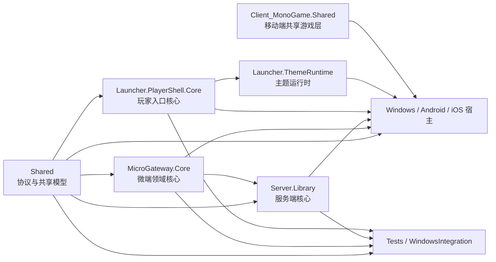

# LyoCrystal 模块地图

- 状态：已接受
- 负责人：项目所有者
- 最后复核日期：2026-08-12
- 事实源：`Legend of Mir.sln`、各 `.csproj` 的 `ProjectReference`、代码入口与 CI
- 适用范围：模块职责、依赖方向、运行入口、测试入口和变更边界

## 1. 总体依赖方向

依赖原则：共享契约和无界面核心位于内层，可执行宿主位于外层；测试可以依赖被测模块，生产模块不得反向依赖测试、编辑器或具体宿主。图中只表达主干方向，精确工程引用以 `.csproj` 为准。

## 2. 子系统导航

| 子系统 | 工程与职责 | 主要入口或接缝 | 最小验证 |
|---|---|---|---|
| 共享契约 | `Shared`：网络包、枚举、共享数据模型、序列化 | `Shared/Packet.cs`；协议源码与生成 manifest | 协议 manifest `--verify`；`ProtocolGeneratedManifestTests` |
| 服务端 | `Server.Library`：游戏状态、持久化、脚本旁路、网络与业务；`Server.MirForms`：Windows 管理宿主 | `Server.MirForms/Program.cs`；`Server/Scripting`；`SchemaMigrator` | `LyoCrystal.Server.slnf` Release 构建；对应 Base05/Windows 集成测试 |
| PC 客户端 | `Client_VorticeDX11`：Windows 游戏客户端；`Launcher.ThemeRuntime` 提供启动主题能力 | `Client_VorticeDX11/Program.cs`；`DXManager`、`SpriteBatchStack` 渲染接缝 | `LyoCrystal.Windows.slnf`；SEC-01/SEC-02 客户端集成测试 |
| 移动客户端 | `Client_MonoGame.Shared`：跨平台游戏逻辑与 UI；`Client_MonoGame.Android`、`Client_MonoGame.iOS` 仅承载平台生命周期与打包 | 各平台 `Program`/Activity/AppDelegate；移动端共享层 | Base05 移动策略测试；Android Release arm64 AOT CI |
| 玩家入口 | `Launcher.PlayerShell.Core`：安装、更新、替换和启动核心；`Launcher.PlayerShell`：玩家 Windows 宿主 | `Launcher.PlayerShell/Program.cs`；Core 中的服务接口 | Launcher GateL0、PlayerShellIntegration；`LyoCrystal.Launcher.slnf` |
| 启动器编辑器 | `Launcher.Editor`：项目/主题编辑宿主；`Launcher.ThemeRuntime`：主题加载与运行 | `Launcher.Editor/Program.cs`；`EditorProjectStore` | PlayerShellIntegration；Launcher 过滤器构建 |
| 微端 | `MicroGateway.Core`：清单、资源与网关核心；`MicroGateway.App`：Windows 管理宿主 | `MicroGateway.App/Program.cs`；已有 `Bootstrap*` 能力 | Base05 微端专项测试；Launcher 过滤器构建 |
| 资源工具 | `LibraryEditor`、`LibraryViewer`、`AutoPatcherAdmin`、`CustomFormControl` | 各 WinForms `Program.cs` | 主解决方案归档；触达时构建对应工程并做样例文件冒烟 |
| 发布工具 | `LauncherPlayerPackager`、`ReleaseSigningTool`、`MobileBootstrapAudit`、`ProtocolManifestGenerator` | 各工具 `Program.cs` 的 CLI | 对应 Base05 测试、manifest 漂移门禁、真实制品审查 |
| 通用测试 | `Base05.Tests`：跨平台回归；`ShareProtocolCompat`：历史移动协议编译夹具 | xUnit 与兼容夹具 | CI 自动发现 `IsTestProject=true` 工程 |
| Windows 集成 | `Sec01.ClientIntegration.Windows`、`Sec02.ClientTlsIntegration.Windows`、`Sec02.ServerConfigIntegration.Windows`、`Launcher.PlayerShellGateL0.Windows`、`Launcher.PlayerShellIntegration.Windows`、`Launcher.RemoteListIntegration.Windows`；`Launcher.PlayerShellReplacementWorker` 是测试辅助进程 | 各 xUnit 工程；ReplacementWorker 不独立作为测试运行器 | Windows CI 或对应 `.csproj` 定向 `dotnet test` |

完整工程清单与逻辑分类由 [`工程治理实施路线.md`](工程治理实施路线.md) §5 维护；构建命令见 [`开发者指南.md`](开发者指南.md)。

## 3. 高风险边界

| 边界 | 必须遵守 | 禁止 |
|---|---|---|
| 协议 | 只修改 `Shared/` 事实源，更新 v2 manifest 与兼容测试 | 修改移动端历史 `Share` 副本或手写第二套序列化 |
| 玩家状态 | 服务端主线程拥有写权限，通过既有调度进入 | 后台任务直接写玩家或世界状态 |
| 脚本 | 使用 `Server/Scripting` 既有旁路 Hook 和输出保护 | 重建脚本热更系统或让脚本绕过主线程边界 |
| 渲染 | 复用 `DXManager`、`SpriteBatchStack` 和现有平台抽象 | 在功能代码中建立第二套设备生命周期 |
| 数据库 | 通过 `SchemaMigrator`、备份与回滚流程演进 | 启动时静默改表或手工覆盖运行数据库 |
| 微端 | 复用 `Bootstrap*`、清单、签名和事务替换 | 重造下载器或绕过清单完整性检查 |
| UI | 复用现有 FairyGUI 运行时与主题运行时 | 为单个功能复制一套 UI 运行时 |
| 发布 | 正式制品来自 CI/发布链，验证摘要、签名与回滚 | 把 Preview、普通 `bin/` 或本地散装 DLL 当正式发布物 |

对应审查责任由 [`.github/CODEOWNERS`](../.github/CODEOWNERS) 维护。

## 4. 功能变更定位规则

1. 先选择拥有业务不变量的最内层模块，再选择宿主适配层；不要从 UI 或 `Program.cs` 反向堆业务逻辑。
2. 新能力优先扩展已有窄接口；只有当调用方不需要理解内部复杂度时才形成新模块。
3. 跨模块通信使用明确 DTO、命令或事件，不暴露可变内部集合和全局状态。
4. 缺陷测试放在最接近行为所有者的测试工程；只依赖 Windows、设备或真实进程的场景进入 `WindowsIntegration`。
5. 新工程必须同时进入 `Legend of Mir.sln`、正确的逻辑解决方案目录、适用 `.slnf` 和 CI；否则工程集合门禁失败。
6. 触达巨型类时只提取本次功能相关、可由回归测试包围的行为簇；不以“整理”为由整体重写。

## 5. 所有权与演进

当前仓库只有 `@Mufeisi` 具备写权限，因此 CODEOWNERS 先以单一责任人覆盖所有模块，并单独列出高风险路径。新增维护者后，应按本表子系统建立可见 GitHub Team 并授予写权限，再替换个人所有权。

物理目录迁移到 `src/`、`Tests/`、`Tools/` 不改变模块边界。ENG-12 已按 [`ADR-0037`](adr/0037-物理目录采用分批迁移.md) 启动渐进迁移；迁移期间以主解决方案、过滤器、本文和 CODEOWNERS 共同提供导航，每批只移动路径并修正引用，不借机改变程序集、命名空间或业务行为。
