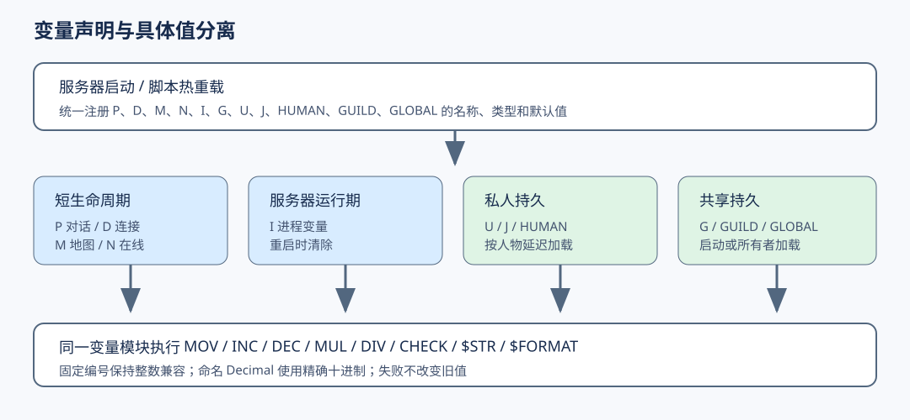

# 变量系统概览

- 功能状态：实验性（VAR-01～07 实现部分）
- 首次支持版本：开发版 2026-08-15
- 适用端：服务端脚本

!!! warning "开发版功能"
    当前已实现 P/D/M/N/S/I/Call 运行时作用域、U/T 私人持久、G/A 全局持久、J/Z 每日周期、HUMAN/GUILD/GLOBAL 自定义持久、L$/D$ 临时复合值、受控公式、显式单位概率、在线跨对象访问、统一运算/比较/显示以及 TXT/C# 声明热重载。指定真实项目已完成预检和进程冒烟；任何新脚本快照仍须重新绑定摘要。

变量系统用于在 NPC 对话、人物在线、地图停留、服务器运行和持久化数据之间保存状态。所有变量都由四部分确定：

1. 类型：整数、小数或字符串；
2. 作用域：谁可以看到；
3. 生命周期：什么时候清除；
4. 名称或编号：脚本如何引用。

按所有者也可概括为私人变量、行会变量和全局变量；“全局变量”在本说明书中指服务器范围共享状态，不表示客户端可以修改。



## 两类变量

### 翎风兼容编号变量

```text
P0
N25
U10
G3
```

固定数值前缀保持整数语义，保证旧脚本的整数除法和范围不会被小数扩展静默改变。

### LyoCrystal 命名变量

```text
VAR Decimal P DropRate DEFAULT 0
VAR Integer HUMAN KillCount DEFAULT 0
```

命名变量具有显式类型和可读名称。整数和小数使用相同操作命令，不需要学习两套语法。

## 相关页面

- [作用域与生命周期](scopes.md)
- [私人持久变量与数据库](persistence.md)
- [全局持久变量与数据库](global-persistence.md)
- [每日周期变量](daily-variables.md)
- [自定义持久作用域](custom-scopes.md)
- [声明、初始化与热重载](declarations.md)
- [命名小数变量](decimal.md)
- [操作与显示命令](commands.md)
- [列表 L$ 与字典 D$](composites.md)
- [公式、概率与格式化](formula-probability.md)
- [当前目标与跨角色变量](cross-object.md)
- [兼容模式与迁移](compatibility-migration.md)
